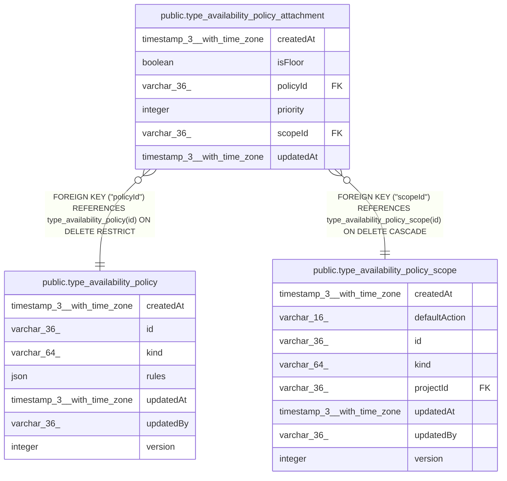

# public.type_availability_policy_attachment

## Columns

| Name | Type | Default | Nullable | Children | Parents | Comment |
| ---- | ---- | ------- | -------- | -------- | ------- | ------- |
| createdAt | timestamp(3) with time zone | CURRENT_TIMESTAMP(3) | false |  |  |  |
| isFloor | boolean | false | false |  |  |  |
| policyId | varchar(36) |  | false |  | [public.type_availability_policy](public.type_availability_policy.md) |  |
| priority | integer |  | false |  |  |  |
| scopeId | varchar(36) |  | false |  | [public.type_availability_policy_scope](public.type_availability_policy_scope.md) |  |
| updatedAt | timestamp(3) with time zone | CURRENT_TIMESTAMP(3) | false |  |  |  |

## Constraints

| Name | Type | Definition |
| ---- | ---- | ---------- |
| FK_118709fc9fe21d3406f81665a53 | FOREIGN KEY | FOREIGN KEY ("scopeId") REFERENCES type_availability_policy_scope(id) ON DELETE CASCADE |
| FK_674705e4c8a3d3eb0736f8e8eee | FOREIGN KEY | FOREIGN KEY ("policyId") REFERENCES type_availability_policy(id) ON DELETE RESTRICT |
| PK_96c1ba2b399ed0aabb047d04f07 | PRIMARY KEY | PRIMARY KEY ("scopeId", "policyId") |
| type_availability_policy_attachment_createdAt_not_null | n | NOT NULL "createdAt" |
| type_availability_policy_attachment_isFloor_not_null | n | NOT NULL "isFloor" |
| type_availability_policy_attachment_policyId_not_null | n | NOT NULL "policyId" |
| type_availability_policy_attachment_priority_not_null | n | NOT NULL priority |
| type_availability_policy_attachment_scopeId_not_null | n | NOT NULL "scopeId" |
| type_availability_policy_attachment_updatedAt_not_null | n | NOT NULL "updatedAt" |

## Indexes

| Name | Definition |
| ---- | ---------- |
| IDX_674705e4c8a3d3eb0736f8e8ee | CREATE INDEX "IDX_674705e4c8a3d3eb0736f8e8ee" ON public.type_availability_policy_attachment USING btree ("policyId") |
| PK_96c1ba2b399ed0aabb047d04f07 | CREATE UNIQUE INDEX "PK_96c1ba2b399ed0aabb047d04f07" ON public.type_availability_policy_attachment USING btree ("scopeId", "policyId") |
| uq_type_availability_attachment_slot | CREATE UNIQUE INDEX uq_type_availability_attachment_slot ON public.type_availability_policy_attachment USING btree ("scopeId", "isFloor", priority) |

## Relations

---

> Generated by [tbls](https://github.com/k1LoW/tbls)
