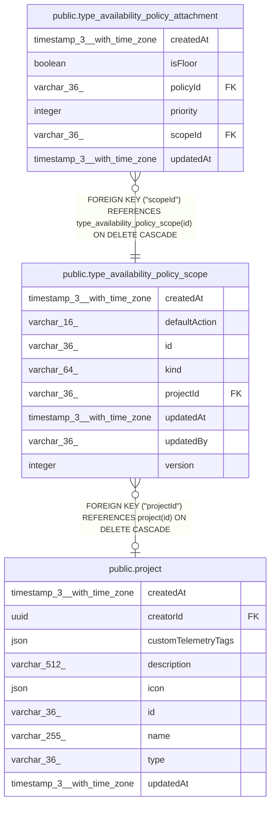

# public.type_availability_policy_scope

## Columns

| Name | Type | Default | Nullable | Children | Parents | Comment |
| ---- | ---- | ------- | -------- | -------- | ------- | ------- |
| createdAt | timestamp(3) with time zone | CURRENT_TIMESTAMP(3) | false |  |  |  |
| defaultAction | varchar(16) |  | false |  |  |  |
| id | varchar(36) |  | false | [public.type_availability_policy_attachment](public.type_availability_policy_attachment.md) |  |  |
| kind | varchar(64) |  | false |  |  |  |
| projectId | varchar(36) |  | true |  | [public.project](public.project.md) |  |
| updatedAt | timestamp(3) with time zone | CURRENT_TIMESTAMP(3) | false |  |  |  |
| updatedBy | varchar(36) |  | false |  |  |  |
| version | integer | 1 | false |  |  |  |

## Constraints

| Name | Type | Definition |
| ---- | ---- | ---------- |
| CHK_type_availability_policy_scope_defaultAction | CHECK | CHECK ((("defaultAction")::text = ANY ((ARRAY['allow'::character varying, 'deny'::character varying, 'delegate'::character varying])::text[]))) |
| FK_73c152c542cea477208c3106193 | FOREIGN KEY | FOREIGN KEY ("projectId") REFERENCES project(id) ON DELETE CASCADE |
| PK_26178b723c376150b45eabdb8e7 | PRIMARY KEY | PRIMARY KEY (id) |
| type_availability_policy_scope_createdAt_not_null | n | NOT NULL "createdAt" |
| type_availability_policy_scope_defaultAction_not_null | n | NOT NULL "defaultAction" |
| type_availability_policy_scope_id_not_null | n | NOT NULL id |
| type_availability_policy_scope_kind_not_null | n | NOT NULL kind |
| type_availability_policy_scope_updatedAt_not_null | n | NOT NULL "updatedAt" |
| type_availability_policy_scope_updatedBy_not_null | n | NOT NULL "updatedBy" |
| type_availability_policy_scope_version_not_null | n | NOT NULL version |

## Indexes

| Name | Definition |
| ---- | ---------- |
| PK_26178b723c376150b45eabdb8e7 | CREATE UNIQUE INDEX "PK_26178b723c376150b45eabdb8e7" ON public.type_availability_policy_scope USING btree (id) |
| uq_type_availability_policy_scope_instance | CREATE UNIQUE INDEX uq_type_availability_policy_scope_instance ON public.type_availability_policy_scope USING btree (kind) WHERE ("projectId" IS NULL) |
| uq_type_availability_policy_scope_project | CREATE UNIQUE INDEX uq_type_availability_policy_scope_project ON public.type_availability_policy_scope USING btree (kind, "projectId") WHERE ("projectId" IS NOT NULL) |

## Relations

---

> Generated by [tbls](https://github.com/k1LoW/tbls)
