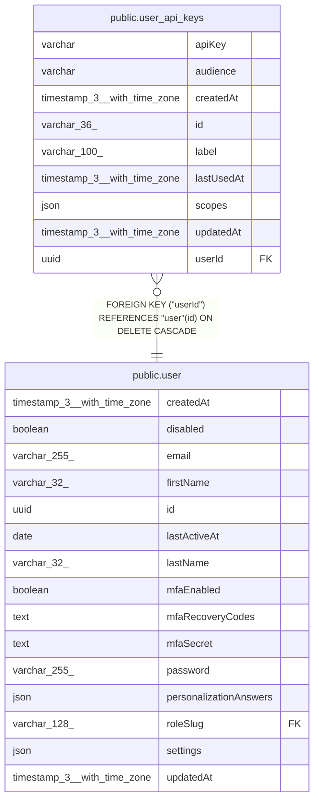

# public.user_api_keys

## Columns

| Name | Type | Default | Nullable | Children | Parents | Comment |
| ---- | ---- | ------- | -------- | -------- | ------- | ------- |
| apiKey | varchar |  | false |  |  |  |
| audience | varchar | 'public-api'::character varying | false |  |  |  |
| createdAt | timestamp(3) with time zone | CURRENT_TIMESTAMP(3) | false |  |  |  |
| id | varchar(36) |  | false |  |  |  |
| label | varchar(100) |  | false |  |  |  |
| lastUsedAt | timestamp(3) with time zone |  | true |  |  |  |
| scopes | json |  | true |  |  |  |
| updatedAt | timestamp(3) with time zone | CURRENT_TIMESTAMP(3) | false |  |  |  |
| userId | uuid |  | false |  | [public.user](public.user.md) |  |

## Constraints

| Name | Type | Definition |
| ---- | ---- | ---------- |
| FK_e131705cbbc8fb589889b02d457 | FOREIGN KEY | FOREIGN KEY ("userId") REFERENCES "user"(id) ON DELETE CASCADE |
| PK_978fa5caa3468f463dac9d92e69 | PRIMARY KEY | PRIMARY KEY (id) |
| user_api_keys_apiKey_not_null | n | NOT NULL "apiKey" |
| user_api_keys_audience_not_null | n | NOT NULL audience |
| user_api_keys_createdAt_not_null | n | NOT NULL "createdAt" |
| user_api_keys_id_not_null | n | NOT NULL id |
| user_api_keys_label_not_null | n | NOT NULL label |
| user_api_keys_updatedAt_not_null | n | NOT NULL "updatedAt" |
| user_api_keys_userId_not_null | n | NOT NULL "userId" |

## Indexes

| Name | Definition |
| ---- | ---------- |
| IDX_1ef35bac35d20bdae979d917a3 | CREATE UNIQUE INDEX "IDX_1ef35bac35d20bdae979d917a3" ON public.user_api_keys USING btree ("apiKey") |
| IDX_63d7bbae72c767cf162d459fcc | CREATE UNIQUE INDEX "IDX_63d7bbae72c767cf162d459fcc" ON public.user_api_keys USING btree ("userId", label) |
| PK_978fa5caa3468f463dac9d92e69 | CREATE UNIQUE INDEX "PK_978fa5caa3468f463dac9d92e69" ON public.user_api_keys USING btree (id) |

## Relations

---

> Generated by [tbls](https://github.com/k1LoW/tbls)
