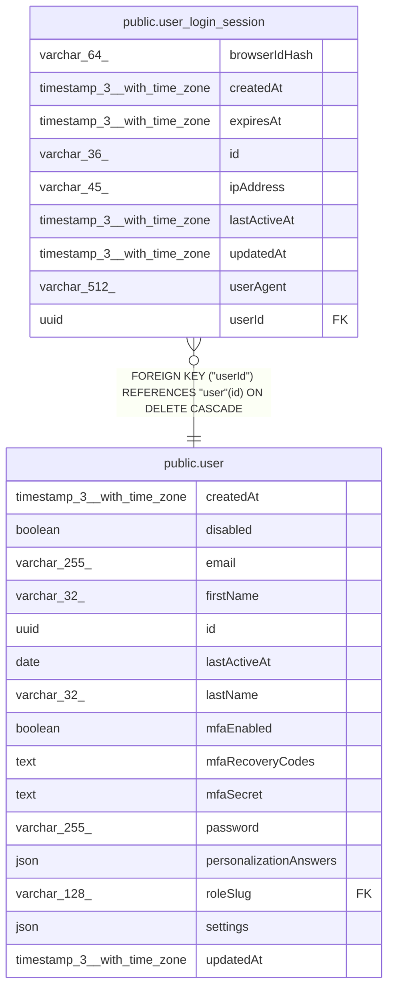

# public.user_login_session

## Columns

| Name | Type | Default | Nullable | Children | Parents | Comment |
| ---- | ---- | ------- | -------- | -------- | ------- | ------- |
| browserIdHash | varchar(64) |  | true |  |  |  |
| createdAt | timestamp(3) with time zone | CURRENT_TIMESTAMP(3) | false |  |  |  |
| expiresAt | timestamp(3) with time zone |  | false |  |  |  |
| id | varchar(36) |  | false |  |  |  |
| ipAddress | varchar(45) |  | true |  |  |  |
| lastActiveAt | timestamp(3) with time zone |  | true |  |  |  |
| updatedAt | timestamp(3) with time zone | CURRENT_TIMESTAMP(3) | false |  |  |  |
| userAgent | varchar(512) |  | true |  |  |  |
| userId | uuid |  | false |  | [public.user](public.user.md) |  |

## Constraints

| Name | Type | Definition |
| ---- | ---- | ---------- |
| FK_043fbbc79e15a2f9999015d226f | FOREIGN KEY | FOREIGN KEY ("userId") REFERENCES "user"(id) ON DELETE CASCADE |
| PK_2f23ffef98725b1673e54164d09 | PRIMARY KEY | PRIMARY KEY (id) |
| user_login_session_createdAt_not_null | n | NOT NULL "createdAt" |
| user_login_session_expiresAt_not_null | n | NOT NULL "expiresAt" |
| user_login_session_id_not_null | n | NOT NULL id |
| user_login_session_updatedAt_not_null | n | NOT NULL "updatedAt" |
| user_login_session_userId_not_null | n | NOT NULL "userId" |

## Indexes

| Name | Definition |
| ---- | ---------- |
| IDX_043fbbc79e15a2f9999015d226 | CREATE INDEX "IDX_043fbbc79e15a2f9999015d226" ON public.user_login_session USING btree ("userId") |
| PK_2f23ffef98725b1673e54164d09 | CREATE UNIQUE INDEX "PK_2f23ffef98725b1673e54164d09" ON public.user_login_session USING btree (id) |

## Relations

---

> Generated by [tbls](https://github.com/k1LoW/tbls)
