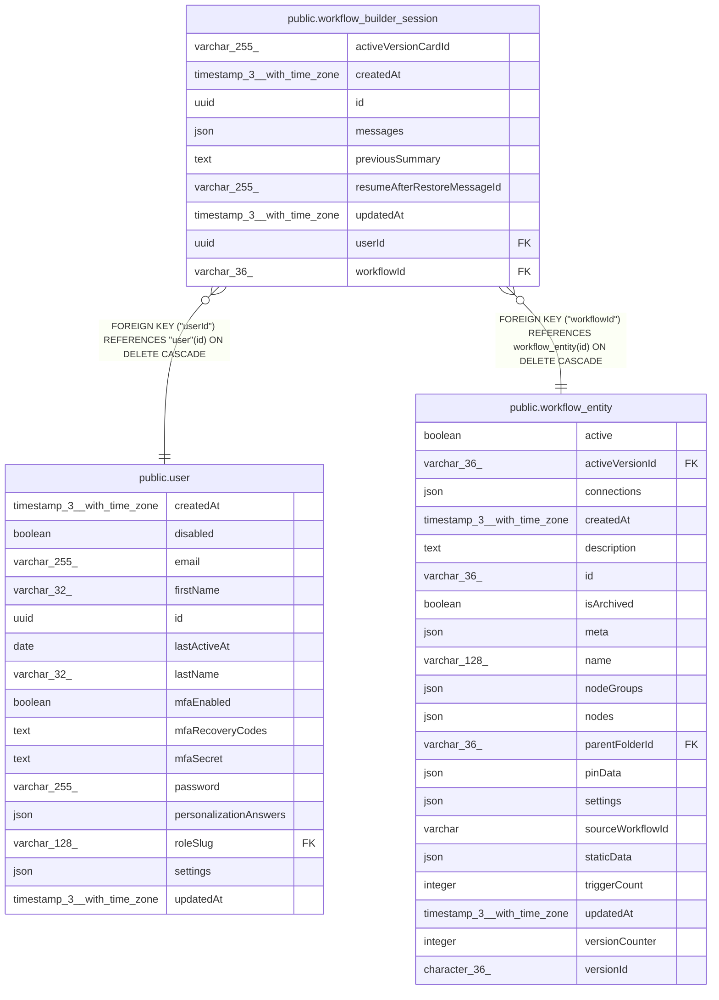

# public.workflow_builder_session

## Columns

| Name | Type | Default | Nullable | Children | Parents | Comment |
| ---- | ---- | ------- | -------- | -------- | ------- | ------- |
| activeVersionCardId | varchar(255) |  | true |  |  |  |
| createdAt | timestamp(3) with time zone | CURRENT_TIMESTAMP(3) | false |  |  |  |
| id | uuid |  | false |  |  |  |
| messages | json | '[]'::json | false |  |  |  |
| previousSummary | text |  | true |  |  | Summary of prior conversation from compaction (/compact or auto-compact) |
| resumeAfterRestoreMessageId | varchar(255) |  | true |  |  |  |
| updatedAt | timestamp(3) with time zone | CURRENT_TIMESTAMP(3) | false |  |  |  |
| userId | uuid |  | false |  | [public.user](public.user.md) |  |
| workflowId | varchar(36) |  | false |  | [public.workflow_entity](public.workflow_entity.md) |  |

## Constraints

| Name | Type | Definition |
| ---- | ---- | ---------- |
| FK_00290cdeee4d4d7db84709be936 | FOREIGN KEY | FOREIGN KEY ("userId") REFERENCES "user"(id) ON DELETE CASCADE |
| FK_7983c618db48f47bf5a4cc1e1e4 | FOREIGN KEY | FOREIGN KEY ("workflowId") REFERENCES workflow_entity(id) ON DELETE CASCADE |
| PK_e69ef0d385986e273423b0e8695 | PRIMARY KEY | PRIMARY KEY (id) |
| UQ_ec2aa73632932d485a1d5192ce1 | UNIQUE | UNIQUE ("workflowId", "userId") |
| workflow_builder_session_createdAt_not_null | n | NOT NULL "createdAt" |
| workflow_builder_session_id_not_null | n | NOT NULL id |
| workflow_builder_session_messages_not_null | n | NOT NULL messages |
| workflow_builder_session_updatedAt_not_null | n | NOT NULL "updatedAt" |
| workflow_builder_session_userId_not_null | n | NOT NULL "userId" |
| workflow_builder_session_workflowId_not_null | n | NOT NULL "workflowId" |

## Indexes

| Name | Definition |
| ---- | ---------- |
| PK_e69ef0d385986e273423b0e8695 | CREATE UNIQUE INDEX "PK_e69ef0d385986e273423b0e8695" ON public.workflow_builder_session USING btree (id) |
| UQ_ec2aa73632932d485a1d5192ce1 | CREATE UNIQUE INDEX "UQ_ec2aa73632932d485a1d5192ce1" ON public.workflow_builder_session USING btree ("workflowId", "userId") |

## Relations

---

> Generated by [tbls](https://github.com/k1LoW/tbls)
