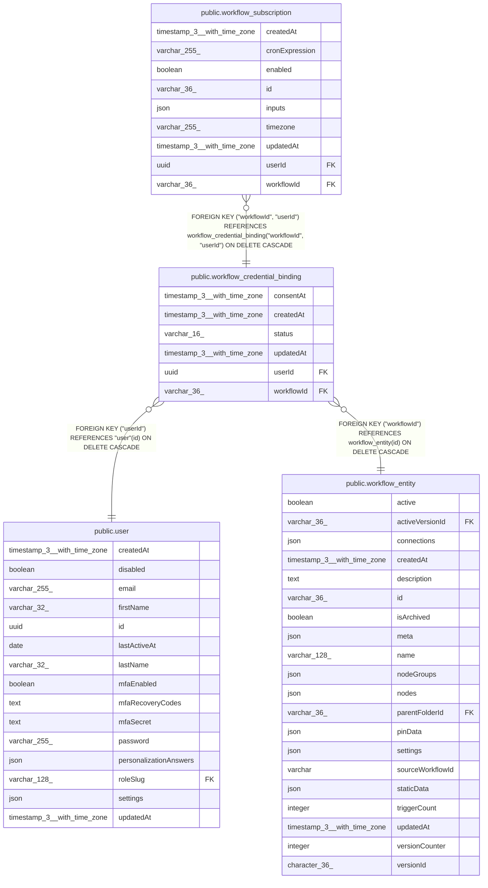

# public.workflow_credential_binding

## Columns

| Name | Type | Default | Nullable | Children | Parents | Comment |
| ---- | ---- | ------- | -------- | -------- | ------- | ------- |
| consentAt | timestamp(3) with time zone |  | false |  |  | When consent was last given; reset when a revoked grant is renewed |
| createdAt | timestamp(3) with time zone | CURRENT_TIMESTAMP(3) | false |  |  |  |
| status | varchar(16) | 'active'::character varying | false |  |  | Whether the person still consents to this workflow running as them; 'revoked' keeps the row rather than deleting the audit trail |
| updatedAt | timestamp(3) with time zone | CURRENT_TIMESTAMP(3) | false |  |  |  |
| userId | uuid |  | false | [public.workflow_subscription](public.workflow_subscription.md) | [public.user](public.user.md) |  |
| workflowId | varchar(36) |  | false | [public.workflow_subscription](public.workflow_subscription.md) | [public.workflow_entity](public.workflow_entity.md) |  |

## Constraints

| Name | Type | Definition |
| ---- | ---- | ---------- |
| CHK_workflow_credential_binding_status | CHECK | CHECK (((status)::text = ANY ((ARRAY['active'::character varying, 'revoked'::character varying])::text[]))) |
| FK_cbd29dd8d24dbb7cce9e4abf1ee | FOREIGN KEY | FOREIGN KEY ("userId") REFERENCES "user"(id) ON DELETE CASCADE |
| FK_e537568aefaad06f226e06cffdd | FOREIGN KEY | FOREIGN KEY ("workflowId") REFERENCES workflow_entity(id) ON DELETE CASCADE |
| PK_462e70fe4fd10b7b9a310a40295 | PRIMARY KEY | PRIMARY KEY ("workflowId", "userId") |
| workflow_credential_binding_consentAt_not_null | n | NOT NULL "consentAt" |
| workflow_credential_binding_createdAt_not_null | n | NOT NULL "createdAt" |
| workflow_credential_binding_status_not_null | n | NOT NULL status |
| workflow_credential_binding_updatedAt_not_null | n | NOT NULL "updatedAt" |
| workflow_credential_binding_userId_not_null | n | NOT NULL "userId" |
| workflow_credential_binding_workflowId_not_null | n | NOT NULL "workflowId" |

## Indexes

| Name | Definition |
| ---- | ---------- |
| IDX_cbd29dd8d24dbb7cce9e4abf1e | CREATE INDEX "IDX_cbd29dd8d24dbb7cce9e4abf1e" ON public.workflow_credential_binding USING btree ("userId") |
| PK_462e70fe4fd10b7b9a310a40295 | CREATE UNIQUE INDEX "PK_462e70fe4fd10b7b9a310a40295" ON public.workflow_credential_binding USING btree ("workflowId", "userId") |

## Relations

---

> Generated by [tbls](https://github.com/k1LoW/tbls)
