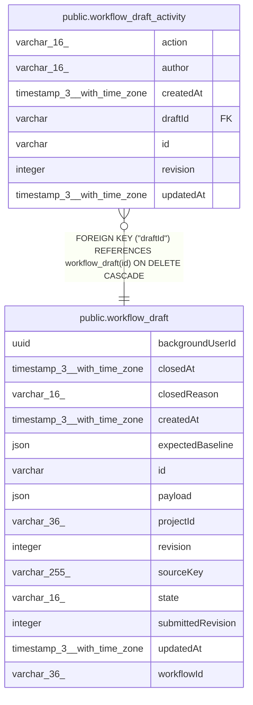

# public.workflow_draft_activity

## Columns

| Name | Type | Default | Nullable | Children | Parents | Comment |
| ---- | ---- | ------- | -------- | -------- | ------- | ------- |
| action | varchar(16) |  | false |  |  | Proposal activity action |
| author | varchar(16) |  | false |  |  | Authorship, separate from the background user |
| createdAt | timestamp(3) with time zone | CURRENT_TIMESTAMP(3) | false |  |  |  |
| draftId | varchar |  | false |  | [public.workflow_draft](public.workflow_draft.md) |  |
| id | varchar |  | false |  |  |  |
| revision | integer |  | false |  |  |  |
| updatedAt | timestamp(3) with time zone | CURRENT_TIMESTAMP(3) | false |  |  |  |

## Constraints

| Name | Type | Definition |
| ---- | ---- | ---------- |
| CHK_workflow_draft_activity_action | CHECK | CHECK (((action)::text = 'submitted'::text)) |
| CHK_workflow_draft_activity_author | CHECK | CHECK (((author)::text = 'assistant'::text)) |
| FK_e8f5dbf00482c8b39592a4e0062 | FOREIGN KEY | FOREIGN KEY ("draftId") REFERENCES workflow_draft(id) ON DELETE CASCADE |
| PK_2ebb3336cd479218e812a6cd0bf | PRIMARY KEY | PRIMARY KEY (id) |
| workflow_draft_activity_action_not_null | n | NOT NULL action |
| workflow_draft_activity_author_not_null | n | NOT NULL author |
| workflow_draft_activity_createdAt_not_null | n | NOT NULL "createdAt" |
| workflow_draft_activity_draftId_not_null | n | NOT NULL "draftId" |
| workflow_draft_activity_id_not_null | n | NOT NULL id |
| workflow_draft_activity_revision_not_null | n | NOT NULL revision |
| workflow_draft_activity_updatedAt_not_null | n | NOT NULL "updatedAt" |

## Indexes

| Name | Definition |
| ---- | ---------- |
| IDX_c7fdcda0e866ac65c287acdb3d | CREATE UNIQUE INDEX "IDX_c7fdcda0e866ac65c287acdb3d" ON public.workflow_draft_activity USING btree ("draftId", action) |
| PK_2ebb3336cd479218e812a6cd0bf | CREATE UNIQUE INDEX "PK_2ebb3336cd479218e812a6cd0bf" ON public.workflow_draft_activity USING btree (id) |

## Relations

---

> Generated by [tbls](https://github.com/k1LoW/tbls)
