# public.workflow_entity

## Columns

| Name | Type | Default | Nullable | Children | Parents | Comment |
| ---- | ---- | ------- | -------- | -------- | ------- | ------- |
| active | boolean |  | false |  |  |  |
| activeVersionId | varchar(36) |  | true |  | [public.workflow_history](public.workflow_history.md) |  |
| connections | json |  | false |  |  |  |
| createdAt | timestamp(3) with time zone | CURRENT_TIMESTAMP(3) | false |  |  |  |
| description | text |  | true |  |  |  |
| id | varchar(36) |  | false | [public.ai_builder_temporary_workflow](public.ai_builder_temporary_workflow.md) [public.chat_hub_messages](public.chat_hub_messages.md) [public.chat_hub_sessions](public.chat_hub_sessions.md) [public.evaluation_collection](public.evaluation_collection.md) [public.evaluation_config](public.evaluation_config.md) [public.execution_entity](public.execution_entity.md) [public.insights_metadata](public.insights_metadata.md) [public.processed_data](public.processed_data.md) [public.shared_workflow](public.shared_workflow.md) [public.test_run](public.test_run.md) [public.webhook_entity](public.webhook_entity.md) [public.workflow_builder_session](public.workflow_builder_session.md) [public.workflow_dependency](public.workflow_dependency.md) [public.workflow_history](public.workflow_history.md) [public.workflow_publication_trigger_status](public.workflow_publication_trigger_status.md) [public.workflow_publish_history](public.workflow_publish_history.md) [public.workflow_published_version](public.workflow_published_version.md) [public.workflows_tags](public.workflows_tags.md) |  |  |
| isArchived | boolean | false | false |  |  |  |
| meta | json |  | true |  |  |  |
| name | varchar(128) |  | false |  |  |  |
| nodeGroups | json | '[]'::json | false |  |  |  |
| nodes | json |  | false |  |  |  |
| parentFolderId | varchar(36) | NULL::character varying | true |  | [public.folder](public.folder.md) |  |
| pinData | json |  | true |  |  |  |
| settings | json |  | true |  |  |  |
| sourceWorkflowId | varchar |  | true |  |  |  |
| staticData | json |  | true |  |  |  |
| triggerCount | integer | 0 | false |  |  |  |
| updatedAt | timestamp(3) with time zone | CURRENT_TIMESTAMP(3) | false |  |  |  |
| versionCounter | integer | 1 | false |  |  |  |
| versionId | character(36) |  | false |  |  |  |

## Constraints

| Name | Type | Definition |
| ---- | ---- | ---------- |
| FK_08d6c67b7f722b0039d9d5ed620 | FOREIGN KEY | FOREIGN KEY ("activeVersionId") REFERENCES workflow_history("versionId") ON DELETE RESTRICT |
| fk_workflow_parent_folder | FOREIGN KEY | FOREIGN KEY ("parentFolderId") REFERENCES folder(id) ON DELETE CASCADE |
| workflow_entity_active_not_null | n | NOT NULL active |
| workflow_entity_connections_not_null | n | NOT NULL connections |
| workflow_entity_createdAt_not_null | n | NOT NULL "createdAt" |
| workflow_entity_id_not_null1 | n | NOT NULL id |
| workflow_entity_isArchived_not_null | n | NOT NULL "isArchived" |
| workflow_entity_name_not_null | n | NOT NULL name |
| workflow_entity_nodeGroups_not_null | n | NOT NULL "nodeGroups" |
| workflow_entity_nodes_not_null | n | NOT NULL nodes |
| workflow_entity_pkey | PRIMARY KEY | PRIMARY KEY (id) |
| workflow_entity_triggerCount_not_null | n | NOT NULL "triggerCount" |
| workflow_entity_updatedAt_not_null | n | NOT NULL "updatedAt" |
| workflow_entity_versionCounter_not_null | n | NOT NULL "versionCounter" |
| workflow_entity_versionId_not_null | n | NOT NULL "versionId" |

## Indexes

| Name | Definition |
| ---- | ---------- |
| IDX_workflow_entity_name | CREATE INDEX "IDX_workflow_entity_name" ON public.workflow_entity USING btree (name) |
| IDX_workflow_entity_sourceWorkflowId | CREATE INDEX "IDX_workflow_entity_sourceWorkflowId" ON public.workflow_entity USING btree ("sourceWorkflowId") WHERE ("sourceWorkflowId" IS NOT NULL) |
| pk_workflow_entity_id | CREATE UNIQUE INDEX pk_workflow_entity_id ON public.workflow_entity USING btree (id) |
| workflow_entity_pkey | CREATE UNIQUE INDEX workflow_entity_pkey ON public.workflow_entity USING btree (id) |

## Triggers

| Name | Definition |
| ---- | ---------- |
| workflow_version_increment | CREATE TRIGGER workflow_version_increment BEFORE UPDATE ON public.workflow_entity FOR EACH ROW EXECUTE FUNCTION increment_workflow_version() |

## Relations

```mermaid
erDiagram

"public.workflow_entity" }o--o| "public.workflow_history" : "FOREIGN KEY (#quot;activeVersionId#quot;) REFERENCES workflow_history(#quot;versionId#quot;) ON DELETE RESTRICT"
"public.ai_builder_temporary_workflow" |o--|| "public.workflow_entity" : "FOREIGN KEY (#quot;workflowId#quot;) REFERENCES workflow_entity(id) ON DELETE CASCADE"
"public.chat_hub_messages" }o--o| "public.workflow_entity" : "FOREIGN KEY (#quot;workflowId#quot;) REFERENCES workflow_entity(id) ON DELETE SET NULL"
"public.chat_hub_sessions" }o--o| "public.workflow_entity" : "FOREIGN KEY (#quot;workflowId#quot;) REFERENCES workflow_entity(id) ON DELETE SET NULL"
"public.evaluation_collection" }o--|| "public.workflow_entity" : "FOREIGN KEY (#quot;workflowId#quot;) REFERENCES workflow_entity(id) ON DELETE CASCADE"
"public.evaluation_config" }o--|| "public.workflow_entity" : "FOREIGN KEY (#quot;workflowId#quot;) REFERENCES workflow_entity(id) ON DELETE CASCADE"
"public.execution_entity" }o--|| "public.workflow_entity" : "FOREIGN KEY (#quot;workflowId#quot;) REFERENCES workflow_entity(id) ON DELETE CASCADE"
"public.insights_metadata" }o--o| "public.workflow_entity" : "FOREIGN KEY (#quot;workflowId#quot;) REFERENCES workflow_entity(id) ON DELETE SET NULL"
"public.processed_data" }o--|| "public.workflow_entity" : "FOREIGN KEY (#quot;workflowId#quot;) REFERENCES workflow_entity(id) ON DELETE CASCADE"
"public.shared_workflow" }o--|| "public.workflow_entity" : "FOREIGN KEY (#quot;workflowId#quot;) REFERENCES workflow_entity(id) ON DELETE CASCADE"
"public.test_run" }o--|| "public.workflow_entity" : "FOREIGN KEY (#quot;workflowId#quot;) REFERENCES workflow_entity(id) ON DELETE CASCADE"
"public.webhook_entity" }o--|| "public.workflow_entity" : "FOREIGN KEY (#quot;workflowId#quot;) REFERENCES workflow_entity(id) ON DELETE CASCADE"
"public.workflow_builder_session" }o--|| "public.workflow_entity" : "FOREIGN KEY (#quot;workflowId#quot;) REFERENCES workflow_entity(id) ON DELETE CASCADE"
"public.workflow_dependency" }o--|| "public.workflow_entity" : "FOREIGN KEY (#quot;workflowId#quot;) REFERENCES workflow_entity(id) ON DELETE CASCADE"
"public.workflow_history" }o--|| "public.workflow_entity" : "FOREIGN KEY (#quot;workflowId#quot;) REFERENCES workflow_entity(id) ON DELETE CASCADE"
"public.workflow_publication_trigger_status" }o--|| "public.workflow_entity" : "FOREIGN KEY (#quot;workflowId#quot;) REFERENCES workflow_entity(id) ON DELETE CASCADE"
"public.workflow_publish_history" }o--|| "public.workflow_entity" : "FOREIGN KEY (#quot;workflowId#quot;) REFERENCES workflow_entity(id) ON DELETE CASCADE"
"public.workflow_published_version" |o--|| "public.workflow_entity" : "FOREIGN KEY (#quot;workflowId#quot;) REFERENCES workflow_entity(id) ON DELETE RESTRICT"
"public.workflows_tags" }o--|| "public.workflow_entity" : "FOREIGN KEY (#quot;workflowId#quot;) REFERENCES workflow_entity(id) ON DELETE CASCADE"
"public.workflow_entity" }o--o| "public.folder" : "FOREIGN KEY (#quot;parentFolderId#quot;) REFERENCES folder(id) ON DELETE CASCADE"

"public.workflow_entity" {
  boolean active
  varchar_36_ activeVersionId FK
  json connections
  timestamp_3__with_time_zone createdAt
  text description
  varchar_36_ id
  boolean isArchived
  json meta
  varchar_128_ name
  json nodeGroups
  json nodes
  varchar_36_ parentFolderId FK
  json pinData
  json settings
  varchar sourceWorkflowId
  json staticData
  integer triggerCount
  timestamp_3__with_time_zone updatedAt
  integer versionCounter
  character_36_ versionId
}
"public.workflow_history" {
  varchar_255_ authors
  boolean autosaved
  json connections
  timestamp_3__with_time_zone createdAt
  text description
  varchar_128_ name
  json nodeGroups
  json nodes
  timestamp_3__with_time_zone updatedAt
  varchar_36_ versionId
  varchar_36_ workflowId FK
}
"public.ai_builder_temporary_workflow" {
  timestamp_3__with_time_zone createdAt
  uuid threadId FK
  timestamp_3__with_time_zone updatedAt
  varchar_36_ workflowId FK
}
"public.chat_hub_messages" {
  uuid agentId FK
  json attachments
  text content
  timestamp_3__with_time_zone createdAt
  integer executionId FK
  uuid id
  varchar_256_ model
  varchar_128_ name
  uuid previousMessageId FK
  varchar_16_ provider
  uuid retryOfMessageId FK
  uuid revisionOfMessageId FK
  uuid sessionId FK
  varchar_16_ status
  varchar_16_ type
  timestamp_3__with_time_zone updatedAt
  varchar_36_ workflowId FK
}
"public.chat_hub_sessions" {
  uuid agentId FK
  varchar_128_ agentName
  timestamp_3__with_time_zone createdAt
  varchar_36_ credentialId FK
  uuid id
  timestamp_3__with_time_zone lastMessageAt
  varchar_256_ model
  uuid ownerId FK
  varchar_16_ provider
  varchar_256_ title
  varchar_16_ type
  timestamp_3__with_time_zone updatedAt
  varchar_36_ workflowId FK
}
"public.evaluation_collection" {
  timestamp_3__with_time_zone createdAt
  uuid createdById FK
  text description
  varchar_36_ evaluationConfigId FK
  varchar_36_ id
  json insightsCache
  varchar_128_ name
  timestamp_3__with_time_zone updatedAt
  varchar_36_ workflowId FK
}
"public.evaluation_config" {
  timestamp_3__with_time_zone createdAt
  json datasetRef
  varchar_32_ datasetSource
  varchar_255_ endNodeName
  varchar_36_ id
  varchar_64_ invalidReason
  json metrics
  varchar_128_ name
  varchar_255_ startNodeName
  varchar_16_ status
  timestamp_3__with_time_zone updatedAt
  varchar_36_ workflowId FK
}
"public.execution_entity" {
  bigint binaryDataSizeBytes
  timestamp_3__with_time_zone createdAt
  varchar_255_ deduplicationKey
  timestamp_3__with_time_zone deletedAt
  boolean finished
  integer id
  bigint jsonSizeBytes
  varchar mode
  varchar retryOf
  varchar retrySuccessId
  timestamp_3__with_time_zone startedAt
  varchar status
  timestamp_3__with_time_zone stoppedAt
  varchar_2_ storedAt
  json tracingContext
  boolean usedPrivateCredentials
  timestamp_3__with_time_zone waitTill
  varchar_36_ workflowId FK
  varchar_36_ workflowVersionId
}
"public.insights_metadata" {
  integer metaId
  varchar_36_ projectId FK
  varchar_255_ projectName
  varchar_36_ workflowId FK
  varchar_128_ workflowName
}
"public.processed_data" {
  varchar_255_ context
  timestamp_3__with_time_zone createdAt
  timestamp_3__with_time_zone updatedAt
  text value
  varchar_36_ workflowId FK
}
"public.shared_workflow" {
  timestamp_3__with_time_zone createdAt
  varchar_36_ projectId FK
  text role
  timestamp_3__with_time_zone updatedAt
  varchar_36_ workflowId FK
}
"public.test_run" {
  boolean cancelRequested
  varchar_36_ collectionId FK
  timestamp_3__with_time_zone completedAt
  timestamp_3__with_time_zone createdAt
  varchar errorCode
  json errorDetails
  varchar_36_ evaluationConfigId FK
  jsonb evaluationConfigSnapshot
  varchar_36_ id
  json metrics
  timestamp_3__with_time_zone runAt
  varchar_255_ runningInstanceId
  varchar status
  timestamp_3__with_time_zone updatedAt
  varchar_36_ workflowId FK
  varchar_36_ workflowVersionId
}
"public.webhook_entity" {
  varchar method
  varchar node
  integer pathLength
  varchar webhookId
  varchar webhookPath
  varchar_36_ workflowId FK
}
"public.workflow_builder_session" {
  varchar_255_ activeVersionCardId
  timestamp_3__with_time_zone createdAt
  uuid id
  json messages
  text previousSummary
  varchar_255_ resumeAfterRestoreMessageId
  timestamp_3__with_time_zone updatedAt
  uuid userId FK
  varchar_36_ workflowId FK
}
"public.workflow_dependency" {
  timestamp_3__with_time_zone createdAt
  json dependencyInfo
  varchar_255_ dependencyKey
  varchar_32_ dependencyType
  integer id
  smallint indexVersionId
  varchar_36_ publishedVersionId
  varchar_36_ workflowId FK
  integer workflowVersionId
}
"public.workflow_publication_trigger_status" {
  timestamp_3__with_time_zone createdAt
  text errorMessage
  varchar_36_ nodeId
  varchar_20_ status
  timestamp_3__with_time_zone updatedAt
  varchar_36_ versionId FK
  varchar_36_ workflowId FK
}
"public.workflow_publish_history" {
  timestamp_3__with_time_zone createdAt
  varchar_36_ event
  integer id
  uuid userId FK
  varchar_36_ versionId FK
  varchar_36_ workflowId FK
}
"public.workflow_published_version" {
  timestamp_3__with_time_zone createdAt
  varchar_36_ publishedVersionId FK
  timestamp_3__with_time_zone updatedAt
  varchar_36_ workflowId FK
}
"public.workflows_tags" {
  varchar_36_ tagId FK
  varchar_36_ workflowId FK
}
"public.folder" {
  timestamp_3__with_time_zone createdAt
  varchar_36_ id
  varchar_128_ name
  varchar_36_ parentFolderId FK
  varchar_36_ projectId FK
  timestamp_3__with_time_zone updatedAt
}
```

---

> Generated by [tbls](https://github.com/k1LoW/tbls)
