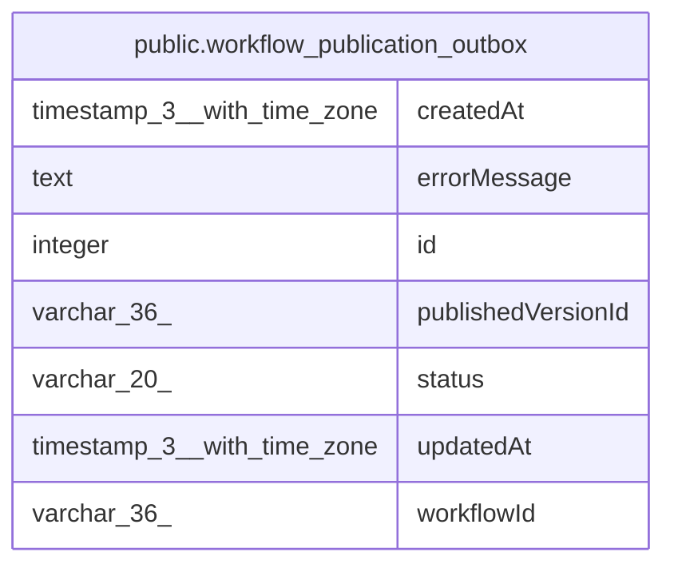

# public.workflow_publication_outbox

## Columns

| Name | Type | Default | Nullable | Children | Parents | Comment |
| ---- | ---- | ------- | -------- | -------- | ------- | ------- |
| createdAt | timestamp(3) with time zone | CURRENT_TIMESTAMP(3) | false |  |  |  |
| errorMessage | text |  | true |  |  | Error details for surfacing failed publications to the user. |
| id | integer |  | false |  |  |  |
| publishedVersionId | varchar(36) |  | false |  |  | References workflow_history.versionId. |
| status | varchar(20) |  | false |  |  |  |
| updatedAt | timestamp(3) with time zone | CURRENT_TIMESTAMP(3) | false |  |  |  |
| workflowId | varchar(36) |  | false |  |  | References workflow_entity.id. |

## Constraints

| Name | Type | Definition |
| ---- | ---- | ---------- |
| CHK_workflow_publication_outbox_status | CHECK | CHECK (((status)::text = ANY ((ARRAY['pending'::character varying, 'in_progress'::character varying, 'completed'::character varying, 'partial_success'::character varying, 'failed'::character varying])::text[]))) |
| PK_b3e2eeee36a4bd044d56468d311 | PRIMARY KEY | PRIMARY KEY (id) |
| workflow_publication_outbox_createdAt_not_null | n | NOT NULL "createdAt" |
| workflow_publication_outbox_id_not_null | n | NOT NULL id |
| workflow_publication_outbox_publishedVersionId_not_null | n | NOT NULL "publishedVersionId" |
| workflow_publication_outbox_status_not_null | n | NOT NULL status |
| workflow_publication_outbox_updatedAt_not_null | n | NOT NULL "updatedAt" |
| workflow_publication_outbox_workflowId_not_null | n | NOT NULL "workflowId" |

## Indexes

| Name | Definition |
| ---- | ---------- |
| IDX_workflow_publication_outbox_active_workflow_status | CREATE UNIQUE INDEX "IDX_workflow_publication_outbox_active_workflow_status" ON public.workflow_publication_outbox USING btree ("workflowId", status) WHERE ((status)::text = ANY ((ARRAY['pending'::character varying, 'in_progress'::character varying])::text[])) |
| PK_b3e2eeee36a4bd044d56468d311 | CREATE UNIQUE INDEX "PK_b3e2eeee36a4bd044d56468d311" ON public.workflow_publication_outbox USING btree (id) |

## Relations

---

> Generated by [tbls](https://github.com/k1LoW/tbls)
