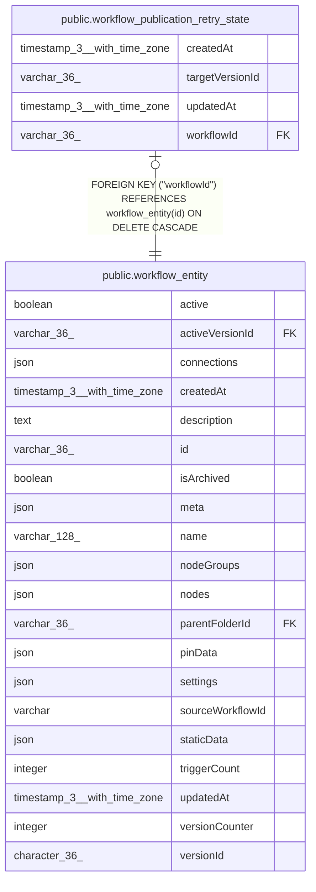

# public.workflow_publication_retry_state

## Columns

| Name | Type | Default | Nullable | Children | Parents | Comment |
| ---- | ---- | ------- | -------- | -------- | ------- | ------- |
| createdAt | timestamp(3) with time zone | CURRENT_TIMESTAMP(3) | false |  |  |  |
| targetVersionId | varchar(36) |  | false |  |  |  |
| updatedAt | timestamp(3) with time zone | CURRENT_TIMESTAMP(3) | false |  |  |  |
| workflowId | varchar(36) |  | false |  | [public.workflow_entity](public.workflow_entity.md) |  |

## Constraints

| Name | Type | Definition |
| ---- | ---- | ---------- |
| FK_7b73bc41b329a0d7ad736f79bb2 | FOREIGN KEY | FOREIGN KEY ("workflowId") REFERENCES workflow_entity(id) ON DELETE CASCADE |
| PK_7b73bc41b329a0d7ad736f79bb2 | PRIMARY KEY | PRIMARY KEY ("workflowId") |
| workflow_publication_retry_state_createdAt_not_null | n | NOT NULL "createdAt" |
| workflow_publication_retry_state_targetVersionId_not_null | n | NOT NULL "targetVersionId" |
| workflow_publication_retry_state_updatedAt_not_null | n | NOT NULL "updatedAt" |
| workflow_publication_retry_state_workflowId_not_null | n | NOT NULL "workflowId" |

## Indexes

| Name | Definition |
| ---- | ---------- |
| PK_7b73bc41b329a0d7ad736f79bb2 | CREATE UNIQUE INDEX "PK_7b73bc41b329a0d7ad736f79bb2" ON public.workflow_publication_retry_state USING btree ("workflowId") |

## Relations

---

> Generated by [tbls](https://github.com/k1LoW/tbls)
