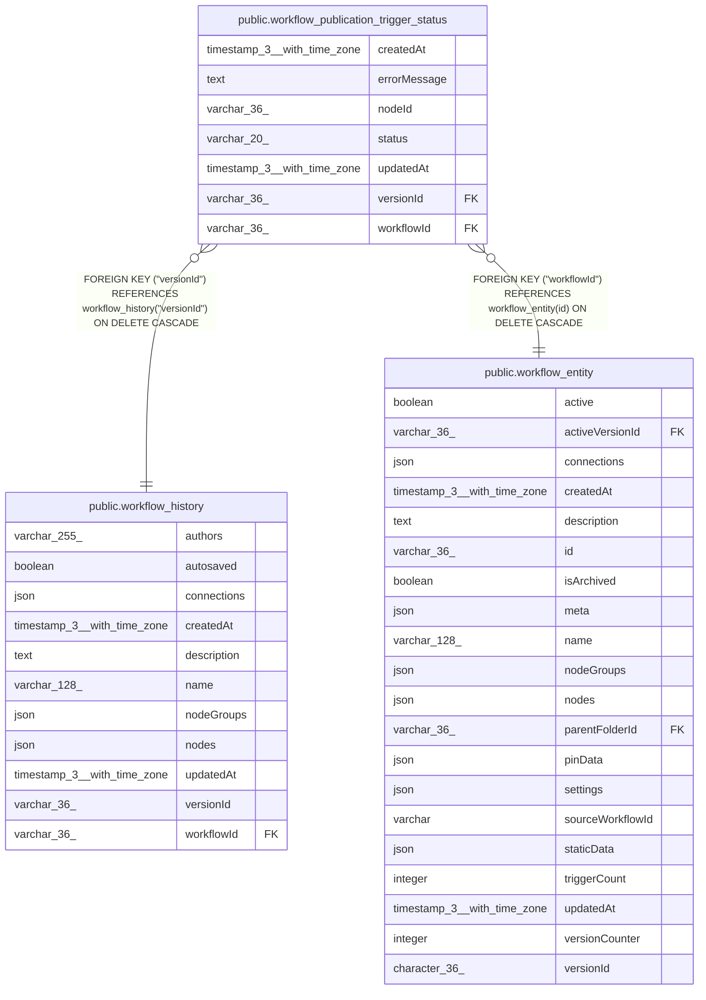

# public.workflow_publication_trigger_status

## Columns

| Name | Type | Default | Nullable | Children | Parents | Comment |
| ---- | ---- | ------- | -------- | -------- | ------- | ------- |
| createdAt | timestamp(3) with time zone | CURRENT_TIMESTAMP(3) | false |  |  |  |
| errorMessage | text |  | true |  |  |  |
| nodeId | varchar(36) |  | false |  |  |  |
| status | varchar(20) |  | false |  |  |  |
| updatedAt | timestamp(3) with time zone | CURRENT_TIMESTAMP(3) | false |  |  |  |
| versionId | varchar(36) |  | false |  | [public.workflow_history](public.workflow_history.md) | References workflow_history.versionId: the published version these statuses were recorded for |
| workflowId | varchar(36) |  | false |  | [public.workflow_entity](public.workflow_entity.md) |  |

## Constraints

| Name | Type | Definition |
| ---- | ---- | ---------- |
| CHK_workflow_publication_trigger_status_status | CHECK | CHECK (((status)::text = ANY ((ARRAY['activated'::character varying, 'failed'::character varying])::text[]))) |
| FK_b7b496d8d1a21158c65f475cd88 | FOREIGN KEY | FOREIGN KEY ("workflowId") REFERENCES workflow_entity(id) ON DELETE CASCADE |
| FK_ef1994db9d0ac1b6a5c89b5f729 | FOREIGN KEY | FOREIGN KEY ("versionId") REFERENCES workflow_history("versionId") ON DELETE CASCADE |
| PK_14aa18b83513fb92d7523909e02 | PRIMARY KEY | PRIMARY KEY ("workflowId", "nodeId") |
| workflow_publication_trigger_status_createdAt_not_null | n | NOT NULL "createdAt" |
| workflow_publication_trigger_status_nodeId_not_null | n | NOT NULL "nodeId" |
| workflow_publication_trigger_status_status_not_null | n | NOT NULL status |
| workflow_publication_trigger_status_updatedAt_not_null | n | NOT NULL "updatedAt" |
| workflow_publication_trigger_status_versionId_not_null | n | NOT NULL "versionId" |
| workflow_publication_trigger_status_workflowId_not_null | n | NOT NULL "workflowId" |

## Indexes

| Name | Definition |
| ---- | ---------- |
| PK_14aa18b83513fb92d7523909e02 | CREATE UNIQUE INDEX "PK_14aa18b83513fb92d7523909e02" ON public.workflow_publication_trigger_status USING btree ("workflowId", "nodeId") |

## Relations

---

> Generated by [tbls](https://github.com/k1LoW/tbls)
