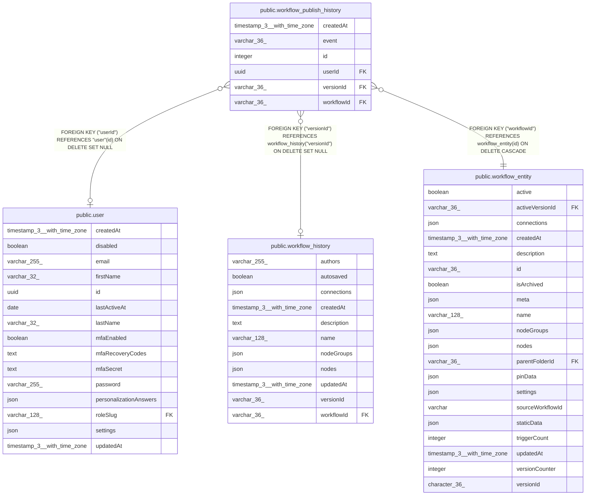

# public.workflow_publish_history

## Columns

| Name | Type | Default | Nullable | Children | Parents | Comment |
| ---- | ---- | ------- | -------- | -------- | ------- | ------- |
| createdAt | timestamp(3) with time zone | CURRENT_TIMESTAMP(3) | false |  |  |  |
| event | varchar(36) |  | false |  |  | Type of history record: activated (workflow is now active), deactivated (workflow is now inactive) |
| id | integer |  | false |  |  |  |
| userId | uuid |  | true |  | [public.user](public.user.md) |  |
| versionId | varchar(36) |  | true |  | [public.workflow_history](public.workflow_history.md) |  |
| workflowId | varchar(36) |  | false |  | [public.workflow_entity](public.workflow_entity.md) |  |

## Constraints

| Name | Type | Definition |
| ---- | ---- | ---------- |
| CHK_workflow_publish_history_event | CHECK | CHECK (((event)::text = ANY ((ARRAY['activated'::character varying, 'deactivated'::character varying])::text[]))) |
| FK_6eab5bd9eedabe9c54bd879fc40 | FOREIGN KEY | FOREIGN KEY ("userId") REFERENCES "user"(id) ON DELETE SET NULL |
| FK_b4cfbc7556d07f36ca177f5e473 | FOREIGN KEY | FOREIGN KEY ("versionId") REFERENCES workflow_history("versionId") ON DELETE SET NULL |
| FK_c01316f8c2d7101ec4fa9809267 | FOREIGN KEY | FOREIGN KEY ("workflowId") REFERENCES workflow_entity(id) ON DELETE CASCADE |
| PK_c788f7caf88e91e365c97d6d04a | PRIMARY KEY | PRIMARY KEY (id) |
| workflow_publish_history_createdAt_not_null | n | NOT NULL "createdAt" |
| workflow_publish_history_event_not_null | n | NOT NULL event |
| workflow_publish_history_id_not_null | n | NOT NULL id |
| workflow_publish_history_workflowId_not_null | n | NOT NULL "workflowId" |

## Indexes

| Name | Definition |
| ---- | ---------- |
| IDX_070b5de842ece9ccdda0d9738b | CREATE INDEX "IDX_070b5de842ece9ccdda0d9738b" ON public.workflow_publish_history USING btree ("workflowId", "versionId") |
| PK_c788f7caf88e91e365c97d6d04a | CREATE UNIQUE INDEX "PK_c788f7caf88e91e365c97d6d04a" ON public.workflow_publish_history USING btree (id) |

## Relations

---

> Generated by [tbls](https://github.com/k1LoW/tbls)
