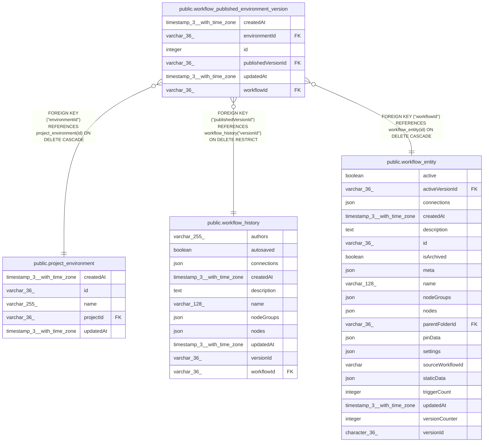

# public.workflow_published_environment_version

## Columns

| Name | Type | Default | Nullable | Children | Parents | Comment |
| ---- | ---- | ------- | -------- | -------- | ------- | ------- |
| createdAt | timestamp(3) with time zone | CURRENT_TIMESTAMP(3) | false |  |  |  |
| environmentId | varchar(36) |  | false |  | [public.project_environment](public.project_environment.md) |  |
| id | integer | nextval('workflow_published_environment_version_id_seq'::regclass) | false |  |  |  |
| publishedVersionId | varchar(36) |  | false |  | [public.workflow_history](public.workflow_history.md) |  |
| updatedAt | timestamp(3) with time zone | CURRENT_TIMESTAMP(3) | false |  |  |  |
| workflowId | varchar(36) |  | false |  | [public.workflow_entity](public.workflow_entity.md) |  |

## Constraints

| Name | Type | Definition |
| ---- | ---- | ---------- |
| FK_00bdc2bb2b15944414034950f5d | FOREIGN KEY | FOREIGN KEY ("publishedVersionId") REFERENCES workflow_history("versionId") ON DELETE RESTRICT |
| FK_2d7601f18eb96fa5407020119cd | FOREIGN KEY | FOREIGN KEY ("environmentId") REFERENCES project_environment(id) ON DELETE CASCADE |
| FK_471e5bd52047db57e393c4dcd04 | FOREIGN KEY | FOREIGN KEY ("workflowId") REFERENCES workflow_entity(id) ON DELETE CASCADE |
| PK_91a843c8aa03a61915c775824e8 | PRIMARY KEY | PRIMARY KEY (id) |
| UQ_b00f98e42c5fdc598c59cb95a4b | UNIQUE | UNIQUE ("workflowId", "environmentId") |
| workflow_published_environment_vers_publishedVersionId_not_null | n | NOT NULL "publishedVersionId" |
| workflow_published_environment_version_createdAt_not_null | n | NOT NULL "createdAt" |
| workflow_published_environment_version_environmentId_not_null | n | NOT NULL "environmentId" |
| workflow_published_environment_version_id_not_null | n | NOT NULL id |
| workflow_published_environment_version_updatedAt_not_null | n | NOT NULL "updatedAt" |
| workflow_published_environment_version_workflowId_not_null | n | NOT NULL "workflowId" |

## Indexes

| Name | Definition |
| ---- | ---------- |
| PK_91a843c8aa03a61915c775824e8 | CREATE UNIQUE INDEX "PK_91a843c8aa03a61915c775824e8" ON public.workflow_published_environment_version USING btree (id) |
| UQ_b00f98e42c5fdc598c59cb95a4b | CREATE UNIQUE INDEX "UQ_b00f98e42c5fdc598c59cb95a4b" ON public.workflow_published_environment_version USING btree ("workflowId", "environmentId") |

## Relations

---

> Generated by [tbls](https://github.com/k1LoW/tbls)
