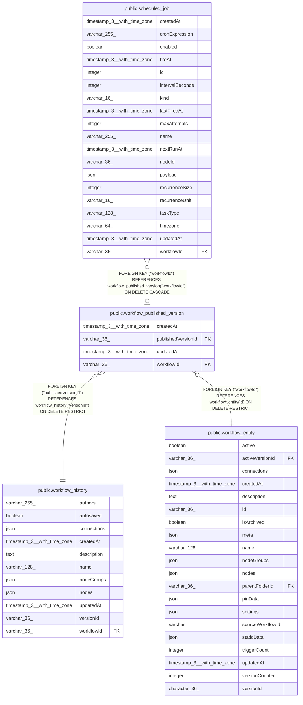

# public.workflow_published_version

## Columns

| Name | Type | Default | Nullable | Children | Parents | Comment |
| ---- | ---- | ------- | -------- | -------- | ------- | ------- |
| createdAt | timestamp(3) with time zone | CURRENT_TIMESTAMP(3) | false |  |  |  |
| publishedVersionId | varchar(36) |  | false |  | [public.workflow_history](public.workflow_history.md) |  |
| updatedAt | timestamp(3) with time zone | CURRENT_TIMESTAMP(3) | false |  |  |  |
| workflowId | varchar(36) |  | false | [public.scheduled_job](public.scheduled_job.md) | [public.workflow_entity](public.workflow_entity.md) |  |

## Constraints

| Name | Type | Definition |
| ---- | ---- | ---------- |
| FK_5c76fb7ee939fe2530374d3f75a | FOREIGN KEY | FOREIGN KEY ("workflowId") REFERENCES workflow_entity(id) ON DELETE RESTRICT |
| FK_df3428a541b802d6a63ac56e330 | FOREIGN KEY | FOREIGN KEY ("publishedVersionId") REFERENCES workflow_history("versionId") ON DELETE RESTRICT |
| PK_5c76fb7ee939fe2530374d3f75a | PRIMARY KEY | PRIMARY KEY ("workflowId") |
| workflow_published_version_createdAt_not_null | n | NOT NULL "createdAt" |
| workflow_published_version_publishedVersionId_not_null | n | NOT NULL "publishedVersionId" |
| workflow_published_version_updatedAt_not_null | n | NOT NULL "updatedAt" |
| workflow_published_version_workflowId_not_null | n | NOT NULL "workflowId" |

## Indexes

| Name | Definition |
| ---- | ---------- |
| PK_5c76fb7ee939fe2530374d3f75a | CREATE UNIQUE INDEX "PK_5c76fb7ee939fe2530374d3f75a" ON public.workflow_published_version USING btree ("workflowId") |

## Relations

---

> Generated by [tbls](https://github.com/k1LoW/tbls)
