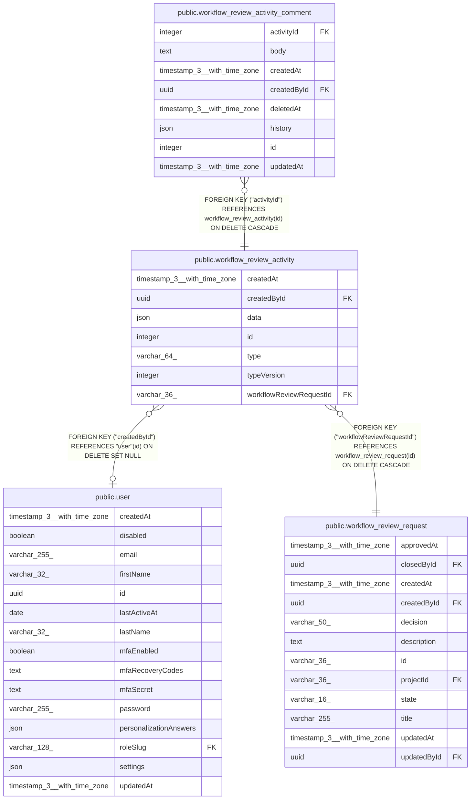

# public.workflow_review_activity

## Columns

| Name | Type | Default | Nullable | Children | Parents | Comment |
| ---- | ---- | ------- | -------- | -------- | ------- | ------- |
| createdAt | timestamp(3) with time zone | CURRENT_TIMESTAMP(3) | false |  |  |  |
| createdById | uuid |  | true |  | [public.user](public.user.md) |  |
| data | json |  | true |  |  | Detail per activity type |
| id | integer |  | false | [public.workflow_review_activity_comment](public.workflow_review_activity_comment.md) |  |  |
| type | varchar(64) |  | false |  |  | Feed entry kind; see WorkflowReviewActivityType in @n8n/api-types |
| typeVersion | integer | 1 | false |  |  | Schema version of the `data` payload for this `type` |
| workflowReviewRequestId | varchar(36) |  | false |  | [public.workflow_review_request](public.workflow_review_request.md) |  |

## Constraints

| Name | Type | Definition |
| ---- | ---- | ---------- |
| FK_61048bf6220dd354c955a9d9379 | FOREIGN KEY | FOREIGN KEY ("workflowReviewRequestId") REFERENCES workflow_review_request(id) ON DELETE CASCADE |
| FK_fcf78b037a72fc7aa01ab237e08 | FOREIGN KEY | FOREIGN KEY ("createdById") REFERENCES "user"(id) ON DELETE SET NULL |
| PK_f1e66ba0b645dec566057ad21e6 | PRIMARY KEY | PRIMARY KEY (id) |
| workflow_review_activity_createdAt_not_null | n | NOT NULL "createdAt" |
| workflow_review_activity_id_not_null | n | NOT NULL id |
| workflow_review_activity_typeVersion_not_null | n | NOT NULL "typeVersion" |
| workflow_review_activity_type_not_null | n | NOT NULL type |
| workflow_review_activity_workflowReviewRequestId_not_null | n | NOT NULL "workflowReviewRequestId" |

## Indexes

| Name | Definition |
| ---- | ---------- |
| IDX_workflow_review_activity_request | CREATE INDEX "IDX_workflow_review_activity_request" ON public.workflow_review_activity USING btree ("workflowReviewRequestId", id) |
| PK_f1e66ba0b645dec566057ad21e6 | CREATE UNIQUE INDEX "PK_f1e66ba0b645dec566057ad21e6" ON public.workflow_review_activity USING btree (id) |

## Relations

---

> Generated by [tbls](https://github.com/k1LoW/tbls)
