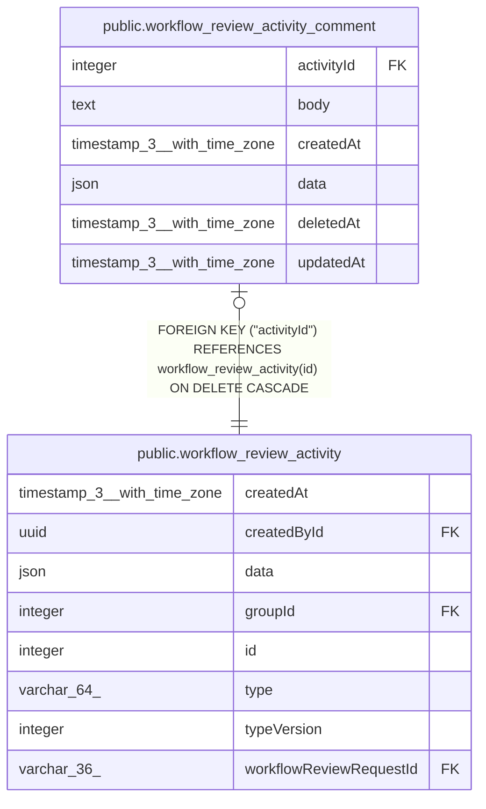

# public.workflow_review_activity_comment

## Columns

| Name | Type | Default | Nullable | Children | Parents | Comment |
| ---- | ---- | ------- | -------- | -------- | ------- | ------- |
| activityId | integer |  | false |  | [public.workflow_review_activity](public.workflow_review_activity.md) |  |
| body | text |  | true |  |  | Only user-editable text in the feed; nulled on delete |
| createdAt | timestamp(3) with time zone | CURRENT_TIMESTAMP(3) | false |  |  |  |
| data | json |  | true |  |  | Reserved for comment revision history; cleared alongside `body` on delete |
| deletedAt | timestamp(3) with time zone |  | true |  |  | Set when the comment is deleted |
| updatedAt | timestamp(3) with time zone |  | true |  |  | Set when the body is edited |

## Constraints

| Name | Type | Definition |
| ---- | ---- | ---------- |
| FK_3cd755e8ce44ee49bdf7e9222ec | FOREIGN KEY | FOREIGN KEY ("activityId") REFERENCES workflow_review_activity(id) ON DELETE CASCADE |
| PK_3cd755e8ce44ee49bdf7e9222ec | PRIMARY KEY | PRIMARY KEY ("activityId") |
| workflow_review_activity_comment_activityId_not_null | n | NOT NULL "activityId" |
| workflow_review_activity_comment_createdAt_not_null | n | NOT NULL "createdAt" |

## Indexes

| Name | Definition |
| ---- | ---------- |
| PK_3cd755e8ce44ee49bdf7e9222ec | CREATE UNIQUE INDEX "PK_3cd755e8ce44ee49bdf7e9222ec" ON public.workflow_review_activity_comment USING btree ("activityId") |

## Relations

---

> Generated by [tbls](https://github.com/k1LoW/tbls)
