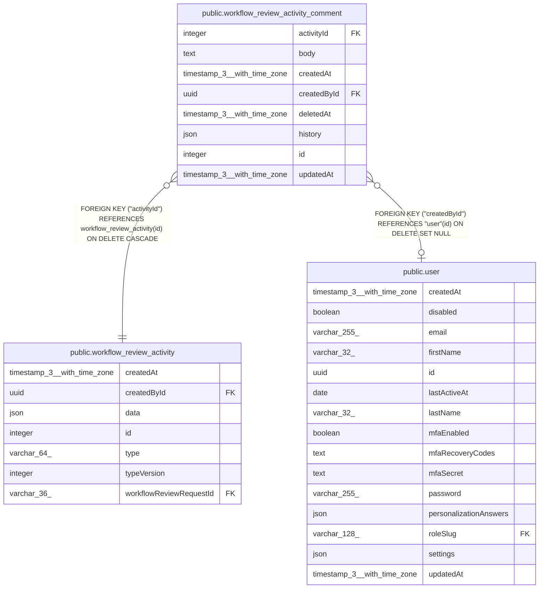

# public.workflow_review_activity_comment

## Columns

| Name | Type | Default | Nullable | Children | Parents | Comment |
| ---- | ---- | ------- | -------- | -------- | ------- | ------- |
| activityId | integer |  | false |  | [public.workflow_review_activity](public.workflow_review_activity.md) | Thread this message belongs to; the activity row is its header |
| body | text |  | true |  |  | Only user-editable text in the feed; nulled on delete |
| createdAt | timestamp(3) with time zone | CURRENT_TIMESTAMP(3) | false |  |  |  |
| createdById | uuid |  | true |  | [public.user](public.user.md) |  |
| deletedAt | timestamp(3) with time zone |  | true |  |  | Set when the comment is deleted |
| history | json |  | true |  |  | Comment revision history. |
| id | integer |  | false |  |  |  |
| updatedAt | timestamp(3) with time zone |  | true |  |  | Set when the body is edited |

## Constraints

| Name | Type | Definition |
| ---- | ---- | ---------- |
| FK_3cd755e8ce44ee49bdf7e9222ec | FOREIGN KEY | FOREIGN KEY ("activityId") REFERENCES workflow_review_activity(id) ON DELETE CASCADE |
| FK_9cfac4b106553d0930a1962bea0 | FOREIGN KEY | FOREIGN KEY ("createdById") REFERENCES "user"(id) ON DELETE SET NULL |
| PK_5a2a7dea8b7e6afa1001129da27 | PRIMARY KEY | PRIMARY KEY (id) |
| workflow_review_activity_comment_activityId_not_null | n | NOT NULL "activityId" |
| workflow_review_activity_comment_createdAt_not_null | n | NOT NULL "createdAt" |
| workflow_review_activity_comment_id_not_null | n | NOT NULL id |

## Indexes

| Name | Definition |
| ---- | ---------- |
| IDX_workflow_review_activity_comment_activity | CREATE INDEX "IDX_workflow_review_activity_comment_activity" ON public.workflow_review_activity_comment USING btree ("activityId", id) |
| PK_5a2a7dea8b7e6afa1001129da27 | CREATE UNIQUE INDEX "PK_5a2a7dea8b7e6afa1001129da27" ON public.workflow_review_activity_comment USING btree (id) |

## Relations

---

> Generated by [tbls](https://github.com/k1LoW/tbls)
