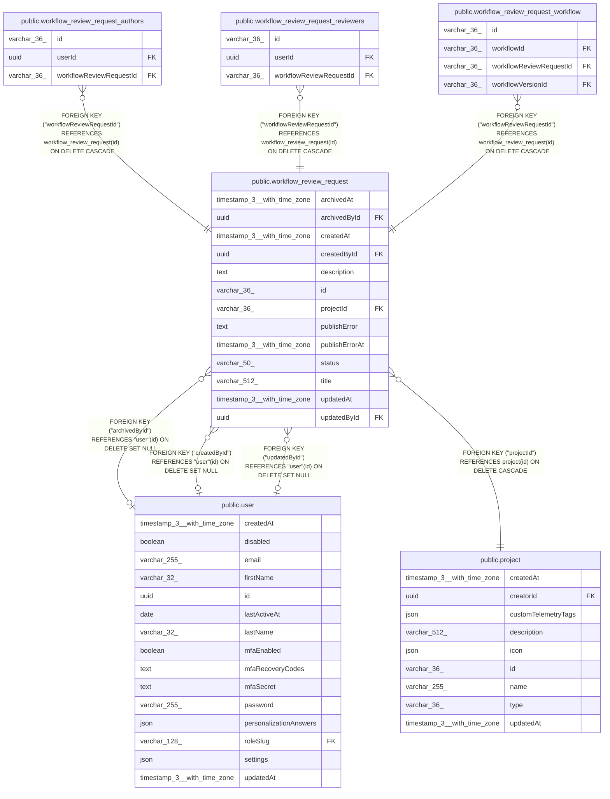

# public.workflow_review_request

## Columns

| Name | Type | Default | Nullable | Children | Parents | Comment |
| ---- | ---- | ------- | -------- | -------- | ------- | ------- |
| archivedAt | timestamp(3) with time zone |  | true |  |  |  |
| archivedById | uuid |  | true |  | [public.user](public.user.md) |  |
| createdAt | timestamp(3) with time zone | CURRENT_TIMESTAMP(3) | false |  |  |  |
| createdById | uuid |  | true |  | [public.user](public.user.md) |  |
| description | text |  | true |  |  |  |
| id | varchar(36) |  | false | [public.workflow_review_request_authors](public.workflow_review_request_authors.md) [public.workflow_review_request_reviewers](public.workflow_review_request_reviewers.md) [public.workflow_review_request_workflow](public.workflow_review_request_workflow.md) |  |  |
| projectId | varchar(36) |  | false |  | [public.project](public.project.md) |  |
| publishError | text |  | true |  |  | Last auto-publish failure message |
| publishErrorAt | timestamp(3) with time zone |  | true |  |  | When publishError was set; cleared on success |
| status | varchar(50) | 'pending'::character varying | false |  |  | Review lifecycle status |
| title | varchar(512) |  | false |  |  |  |
| updatedAt | timestamp(3) with time zone | CURRENT_TIMESTAMP(3) | false |  |  |  |
| updatedById | uuid |  | true |  | [public.user](public.user.md) |  |

## Constraints

| Name | Type | Definition |
| ---- | ---- | ---------- |
| CHK_workflow_review_request_status | CHECK | CHECK (((status)::text = ANY ((ARRAY['pending'::character varying, 'changes_requested'::character varying, 'approved'::character varying])::text[]))) |
| FK_21d5f5a831d2e38960030bb4f60 | FOREIGN KEY | FOREIGN KEY ("createdById") REFERENCES "user"(id) ON DELETE SET NULL |
| FK_2817c3a0245197b498818c447cb | FOREIGN KEY | FOREIGN KEY ("updatedById") REFERENCES "user"(id) ON DELETE SET NULL |
| FK_c218d1df94adc3b169dee3cc06c | FOREIGN KEY | FOREIGN KEY ("projectId") REFERENCES project(id) ON DELETE CASCADE |
| FK_eeec335aaf638c3832fb60ad405 | FOREIGN KEY | FOREIGN KEY ("archivedById") REFERENCES "user"(id) ON DELETE SET NULL |
| PK_ae17b90023bcd05e003cd8f64dc | PRIMARY KEY | PRIMARY KEY (id) |
| workflow_review_request_createdAt_not_null | n | NOT NULL "createdAt" |
| workflow_review_request_id_not_null | n | NOT NULL id |
| workflow_review_request_projectId_not_null | n | NOT NULL "projectId" |
| workflow_review_request_status_not_null | n | NOT NULL status |
| workflow_review_request_title_not_null | n | NOT NULL title |
| workflow_review_request_updatedAt_not_null | n | NOT NULL "updatedAt" |

## Indexes

| Name | Definition |
| ---- | ---------- |
| IDX_workflow_review_request_open_project_created | CREATE INDEX "IDX_workflow_review_request_open_project_created" ON public.workflow_review_request USING btree ("projectId", "createdAt" DESC) WHERE (((status)::text = ANY ((ARRAY['pending'::character varying, 'changes_requested'::character varying])::text[])) AND ("archivedAt" IS NULL)) |
| IDX_workflow_review_request_project_status_created | CREATE INDEX "IDX_workflow_review_request_project_status_created" ON public.workflow_review_request USING btree ("projectId", status, "createdAt" DESC) |
| PK_ae17b90023bcd05e003cd8f64dc | CREATE UNIQUE INDEX "PK_ae17b90023bcd05e003cd8f64dc" ON public.workflow_review_request USING btree (id) |

## Relations

---

> Generated by [tbls](https://github.com/k1LoW/tbls)
