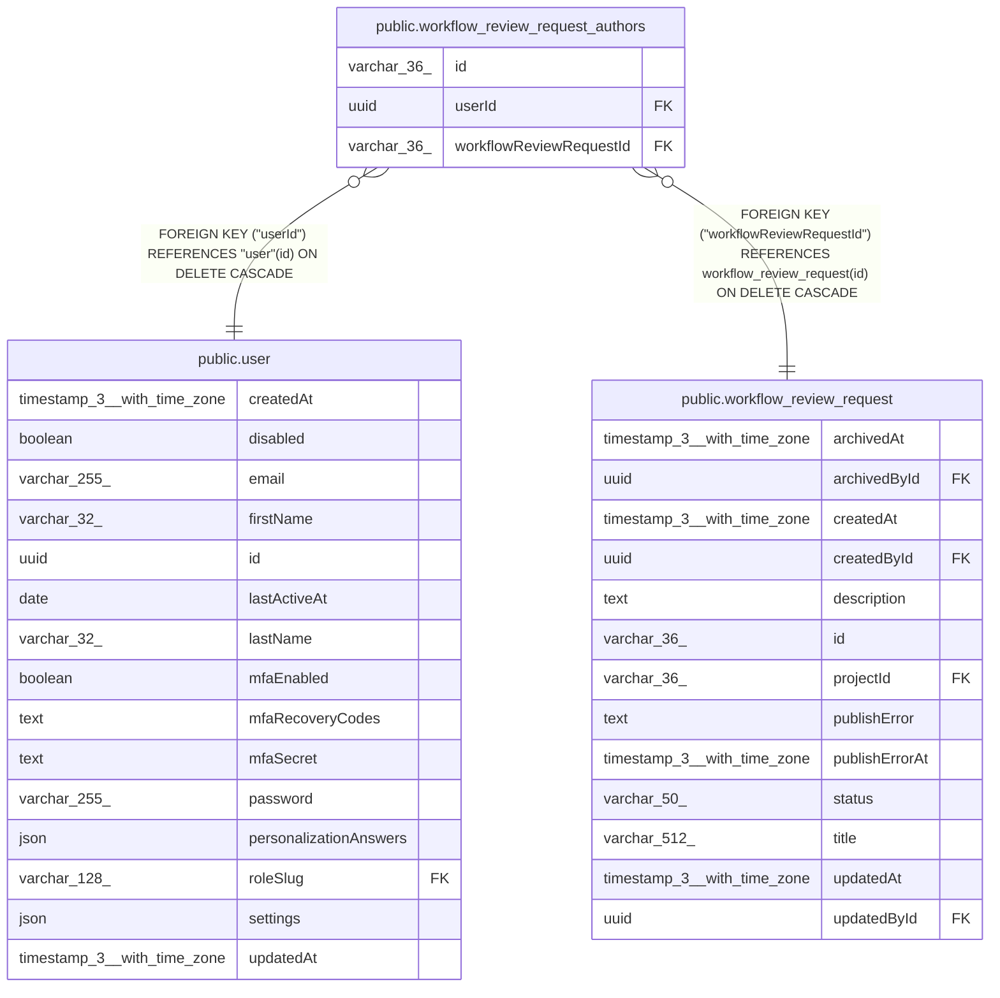

# public.workflow_review_request_authors

## Columns

| Name | Type | Default | Nullable | Children | Parents | Comment |
| ---- | ---- | ------- | -------- | -------- | ------- | ------- |
| id | varchar(36) |  | false |  |  |  |
| userId | uuid |  | false |  | [public.user](public.user.md) |  |
| workflowReviewRequestId | varchar(36) |  | false |  | [public.workflow_review_request](public.workflow_review_request.md) |  |

## Constraints

| Name | Type | Definition |
| ---- | ---- | ---------- |
| FK_a9c79ab0c352aa0496c39ea56a4 | FOREIGN KEY | FOREIGN KEY ("userId") REFERENCES "user"(id) ON DELETE CASCADE |
| FK_c255ae5087010c1ab73ac8684af | FOREIGN KEY | FOREIGN KEY ("workflowReviewRequestId") REFERENCES workflow_review_request(id) ON DELETE CASCADE |
| PK_47755615899710169aada453e6e | PRIMARY KEY | PRIMARY KEY (id) |
| workflow_review_request_author_workflowReviewRequestId_not_null | n | NOT NULL "workflowReviewRequestId" |
| workflow_review_request_authors_id_not_null | n | NOT NULL id |
| workflow_review_request_authors_userId_not_null | n | NOT NULL "userId" |

## Indexes

| Name | Definition |
| ---- | ---------- |
| IDX_workflow_review_request_authors_request_user | CREATE UNIQUE INDEX "IDX_workflow_review_request_authors_request_user" ON public.workflow_review_request_authors USING btree ("workflowReviewRequestId", "userId") |
| IDX_workflow_review_request_authors_user_id | CREATE INDEX "IDX_workflow_review_request_authors_user_id" ON public.workflow_review_request_authors USING btree ("userId") |
| PK_47755615899710169aada453e6e | CREATE UNIQUE INDEX "PK_47755615899710169aada453e6e" ON public.workflow_review_request_authors USING btree (id) |

## Relations

---

> Generated by [tbls](https://github.com/k1LoW/tbls)
