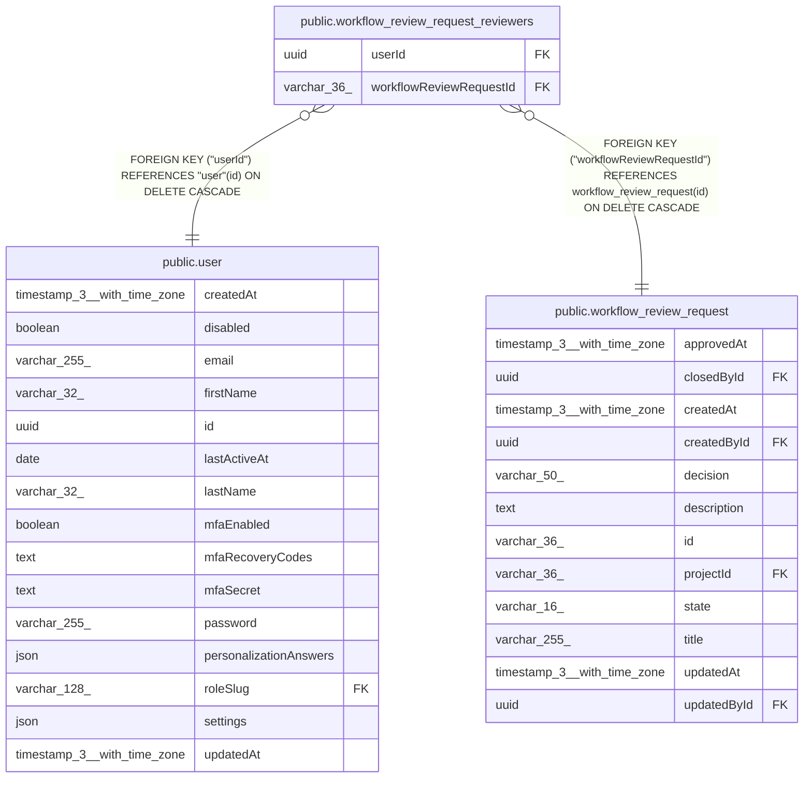

# public.workflow_review_request_reviewers

## Columns

| Name | Type | Default | Nullable | Children | Parents | Comment |
| ---- | ---- | ------- | -------- | -------- | ------- | ------- |
| userId | uuid |  | false |  | [public.user](public.user.md) |  |
| workflowReviewRequestId | varchar(36) |  | false |  | [public.workflow_review_request](public.workflow_review_request.md) |  |

## Constraints

| Name | Type | Definition |
| ---- | ---- | ---------- |
| FK_81d0a2584aa4e8e5e0d6aa68f32 | FOREIGN KEY | FOREIGN KEY ("userId") REFERENCES "user"(id) ON DELETE CASCADE |
| FK_ba29e1cc5cdba43ce7b810b3ddd | FOREIGN KEY | FOREIGN KEY ("workflowReviewRequestId") REFERENCES workflow_review_request(id) ON DELETE CASCADE |
| PK_4715c6035e0ebc4f3e8716f1e34 | PRIMARY KEY | PRIMARY KEY ("workflowReviewRequestId", "userId") |
| workflow_review_request_review_workflowReviewRequestId_not_null | n | NOT NULL "workflowReviewRequestId" |
| workflow_review_request_reviewers_userId_not_null | n | NOT NULL "userId" |

## Indexes

| Name | Definition |
| ---- | ---------- |
| IDX_workflow_review_request_reviewers_user | CREATE INDEX "IDX_workflow_review_request_reviewers_user" ON public.workflow_review_request_reviewers USING btree ("userId", "workflowReviewRequestId") |
| PK_4715c6035e0ebc4f3e8716f1e34 | CREATE UNIQUE INDEX "PK_4715c6035e0ebc4f3e8716f1e34" ON public.workflow_review_request_reviewers USING btree ("workflowReviewRequestId", "userId") |

## Relations

---

> Generated by [tbls](https://github.com/k1LoW/tbls)
