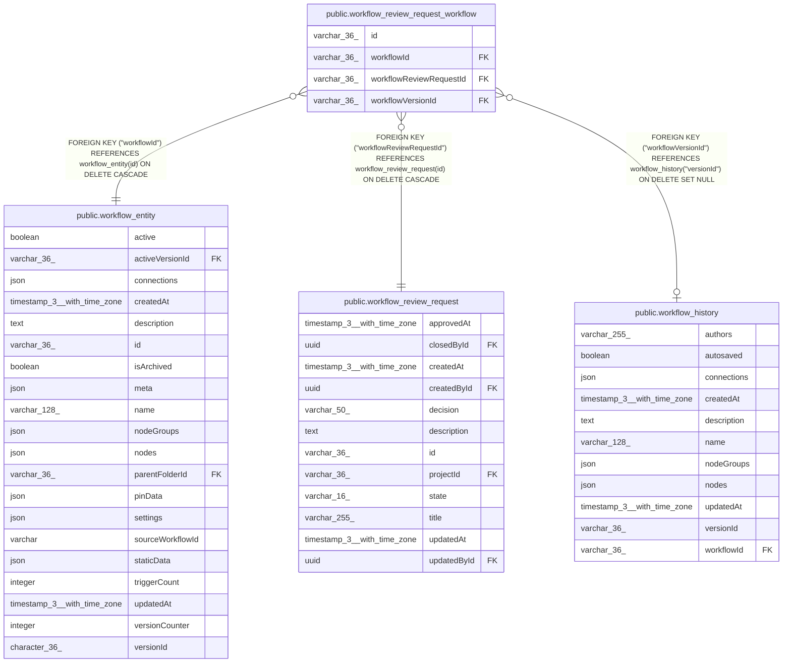

# public.workflow_review_request_workflow

## Columns

| Name | Type | Default | Nullable | Children | Parents | Comment |
| ---- | ---- | ------- | -------- | -------- | ------- | ------- |
| id | varchar(36) |  | false |  |  |  |
| workflowId | varchar(36) |  | false |  | [public.workflow_entity](public.workflow_entity.md) |  |
| workflowReviewRequestId | varchar(36) |  | false |  | [public.workflow_review_request](public.workflow_review_request.md) |  |
| workflowVersionId | varchar(36) |  | true |  | [public.workflow_history](public.workflow_history.md) | Pinned workflow_history version for this review item |

## Constraints

| Name | Type | Definition |
| ---- | ---- | ---------- |
| FK_0f6f0f2c6d46b806fee02962ac2 | FOREIGN KEY | FOREIGN KEY ("workflowVersionId") REFERENCES workflow_history("versionId") ON DELETE SET NULL |
| FK_619f5b0544bcec60c3387e82f2f | FOREIGN KEY | FOREIGN KEY ("workflowId") REFERENCES workflow_entity(id) ON DELETE CASCADE |
| FK_e44b652e6dc99ef1364a2d85504 | FOREIGN KEY | FOREIGN KEY ("workflowReviewRequestId") REFERENCES workflow_review_request(id) ON DELETE CASCADE |
| PK_be3bf4facb054cf2b2b116b3b9c | PRIMARY KEY | PRIMARY KEY (id) |
| workflow_review_request_workfl_workflowReviewRequestId_not_null | n | NOT NULL "workflowReviewRequestId" |
| workflow_review_request_workflow_id_not_null | n | NOT NULL id |
| workflow_review_request_workflow_workflowId_not_null | n | NOT NULL "workflowId" |

## Indexes

| Name | Definition |
| ---- | ---------- |
| IDX_workflow_review_request_workflow_workflow_request | CREATE INDEX "IDX_workflow_review_request_workflow_workflow_request" ON public.workflow_review_request_workflow USING btree ("workflowId", "workflowReviewRequestId") |
| PK_be3bf4facb054cf2b2b116b3b9c | CREATE UNIQUE INDEX "PK_be3bf4facb054cf2b2b116b3b9c" ON public.workflow_review_request_workflow USING btree (id) |
| UQ_workflow_review_request_workflow_request_workflow | CREATE UNIQUE INDEX "UQ_workflow_review_request_workflow_request_workflow" ON public.workflow_review_request_workflow USING btree ("workflowReviewRequestId", "workflowId") |

## Relations

---

> Generated by [tbls](https://github.com/k1LoW/tbls)
