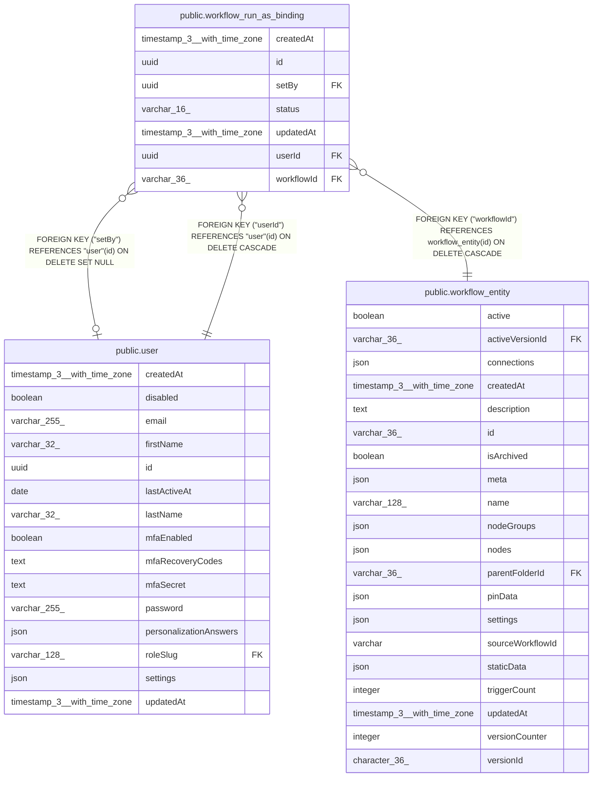

# public.workflow_run_as_binding

## Columns

| Name | Type | Default | Nullable | Children | Parents | Comment |
| ---- | ---- | ------- | -------- | -------- | ------- | ------- |
| createdAt | timestamp(3) with time zone | CURRENT_TIMESTAMP(3) | false |  |  |  |
| id | uuid |  | false |  |  |  |
| setBy | uuid |  | true |  | [public.user](public.user.md) | Who claimed the binding. The service enforces setBy equal to userId. |
| status | varchar(16) |  | false |  |  | active: scheduled runs use userId. revoked: kept for audit only. |
| updatedAt | timestamp(3) with time zone | CURRENT_TIMESTAMP(3) | false |  |  |  |
| userId | uuid |  | false |  | [public.user](public.user.md) | The n8n user scheduled runs execute as |
| workflowId | varchar(36) |  | false |  | [public.workflow_entity](public.workflow_entity.md) |  |

## Constraints

| Name | Type | Definition |
| ---- | ---- | ---------- |
| CHK_workflow_run_as_binding_status | CHECK | CHECK (((status)::text = ANY ((ARRAY['active'::character varying, 'revoked'::character varying])::text[]))) |
| FK_0e488ef82cc786d5e970284d619 | FOREIGN KEY | FOREIGN KEY ("userId") REFERENCES "user"(id) ON DELETE CASCADE |
| FK_bb2ed466900360d24724eeb84ab | FOREIGN KEY | FOREIGN KEY ("setBy") REFERENCES "user"(id) ON DELETE SET NULL |
| FK_ef20594e96843c66be3a43b2f84 | FOREIGN KEY | FOREIGN KEY ("workflowId") REFERENCES workflow_entity(id) ON DELETE CASCADE |
| PK_e29239dab1b5a35746f1c73a3f0 | PRIMARY KEY | PRIMARY KEY (id) |
| workflow_run_as_binding_createdAt_not_null | n | NOT NULL "createdAt" |
| workflow_run_as_binding_id_not_null | n | NOT NULL id |
| workflow_run_as_binding_status_not_null | n | NOT NULL status |
| workflow_run_as_binding_updatedAt_not_null | n | NOT NULL "updatedAt" |
| workflow_run_as_binding_userId_not_null | n | NOT NULL "userId" |
| workflow_run_as_binding_workflowId_not_null | n | NOT NULL "workflowId" |

## Indexes

| Name | Definition |
| ---- | ---------- |
| IDX_0e488ef82cc786d5e970284d61 | CREATE INDEX "IDX_0e488ef82cc786d5e970284d61" ON public.workflow_run_as_binding USING btree ("userId") |
| IDX_workflow_run_as_binding_workflowId | CREATE UNIQUE INDEX "IDX_workflow_run_as_binding_workflowId" ON public.workflow_run_as_binding USING btree ("workflowId") WHERE ((status)::text = 'active'::text) |
| PK_e29239dab1b5a35746f1c73a3f0 | CREATE UNIQUE INDEX "PK_e29239dab1b5a35746f1c73a3f0" ON public.workflow_run_as_binding USING btree (id) |

## Relations

---

> Generated by [tbls](https://github.com/k1LoW/tbls)
