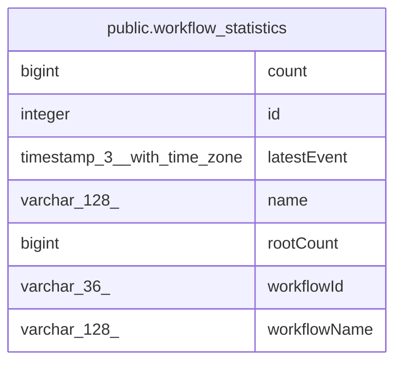

# public.workflow_statistics

## Columns

| Name | Type | Default | Nullable | Children | Parents | Comment |
| ---- | ---- | ------- | -------- | -------- | ------- | ------- |
| count | bigint | 0 | true |  |  |  |
| id | integer | nextval('workflow_statistics_id_seq'::regclass) | false |  |  |  |
| latestEvent | timestamp(3) with time zone |  | true |  |  |  |
| name | varchar(128) |  | false |  |  |  |
| rootCount | bigint | 0 | true |  |  |  |
| workflowId | varchar(36) |  | false |  |  |  |
| workflowName | varchar(128) |  | true |  |  |  |

## Constraints

| Name | Type | Definition |
| ---- | ---- | ---------- |
| workflow_statistics_id_not_null | n | NOT NULL id |
| workflow_statistics_name_not_null | n | NOT NULL name |
| workflow_statistics_pkey | PRIMARY KEY | PRIMARY KEY (id) |
| workflow_statistics_workflowId_not_null1 | n | NOT NULL "workflowId" |

## Indexes

| Name | Definition |
| ---- | ---------- |
| IDX_workflow_statistics_workflow_name | CREATE UNIQUE INDEX "IDX_workflow_statistics_workflow_name" ON public.workflow_statistics USING btree ("workflowId", name) |
| workflow_statistics_pkey | CREATE UNIQUE INDEX workflow_statistics_pkey ON public.workflow_statistics USING btree (id) |

## Relations

---

> Generated by [tbls](https://github.com/k1LoW/tbls)
