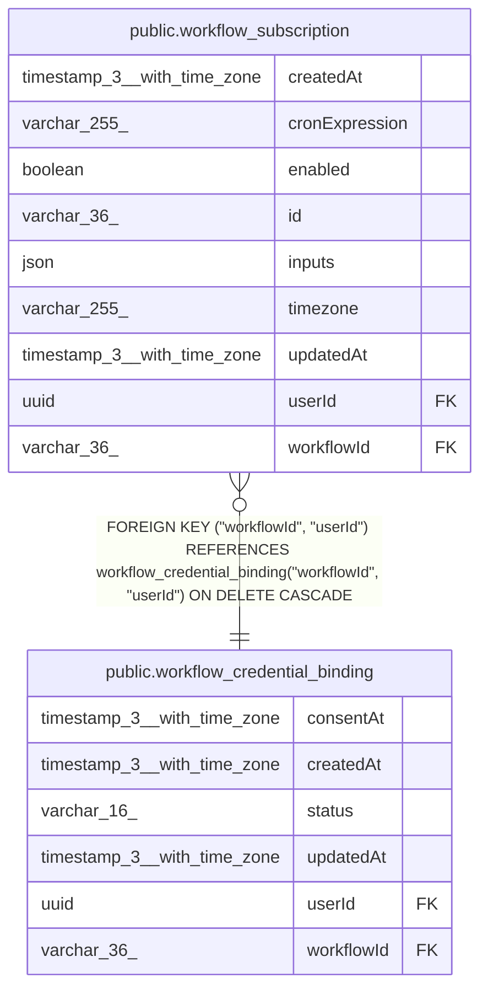

# public.workflow_subscription

## Columns

| Name | Type | Default | Nullable | Children | Parents | Comment |
| ---- | ---- | ------- | -------- | -------- | ------- | ------- |
| createdAt | timestamp(3) with time zone | CURRENT_TIMESTAMP(3) | false |  |  |  |
| cronExpression | varchar(255) |  | false |  |  | When this person's run fires, as a 5- or 6-field cron expression |
| enabled | boolean | true | false |  |  | A paused subscription keeps its row and inputs; its scheduler jobs are removed |
| id | varchar(36) |  | false |  |  |  |
| inputs | json |  | false |  |  | Values for the fields the workflow's trigger declares, filtered against that contract before each run |
| timezone | varchar(255) |  | false |  |  | IANA zone the cron expression is read in, e.g. Europe/Berlin |
| updatedAt | timestamp(3) with time zone | CURRENT_TIMESTAMP(3) | false |  |  |  |
| userId | uuid |  | false |  | [public.workflow_credential_binding](public.workflow_credential_binding.md) |  |
| workflowId | varchar(36) |  | false |  | [public.workflow_credential_binding](public.workflow_credential_binding.md) |  |

## Constraints

| Name | Type | Definition |
| ---- | ---- | ---------- |
| FK_fbfc34f85307e8b012bccb9009d | FOREIGN KEY | FOREIGN KEY ("workflowId", "userId") REFERENCES workflow_credential_binding("workflowId", "userId") ON DELETE CASCADE |
| PK_a4d8e82383770ef8fe631472857 | PRIMARY KEY | PRIMARY KEY (id) |
| workflow_subscription_createdAt_not_null | n | NOT NULL "createdAt" |
| workflow_subscription_cronExpression_not_null | n | NOT NULL "cronExpression" |
| workflow_subscription_enabled_not_null | n | NOT NULL enabled |
| workflow_subscription_id_not_null | n | NOT NULL id |
| workflow_subscription_inputs_not_null | n | NOT NULL inputs |
| workflow_subscription_timezone_not_null | n | NOT NULL timezone |
| workflow_subscription_updatedAt_not_null | n | NOT NULL "updatedAt" |
| workflow_subscription_userId_not_null | n | NOT NULL "userId" |
| workflow_subscription_workflowId_not_null | n | NOT NULL "workflowId" |

## Indexes

| Name | Definition |
| ---- | ---------- |
| IDX_acff6aa3959530d3e9c117e99f | CREATE INDEX "IDX_acff6aa3959530d3e9c117e99f" ON public.workflow_subscription USING btree ("userId") |
| IDX_fbfc34f85307e8b012bccb9009 | CREATE INDEX "IDX_fbfc34f85307e8b012bccb9009" ON public.workflow_subscription USING btree ("workflowId", "userId") |
| PK_a4d8e82383770ef8fe631472857 | CREATE UNIQUE INDEX "PK_a4d8e82383770ef8fe631472857" ON public.workflow_subscription USING btree (id) |

## Relations

---

> Generated by [tbls](https://github.com/k1LoW/tbls)
