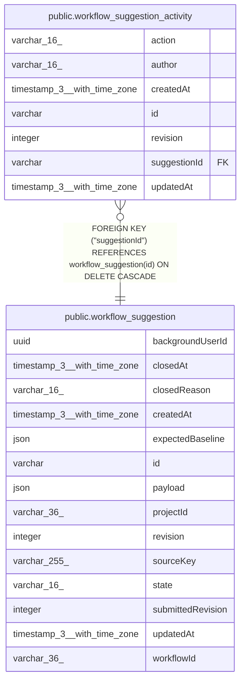

# public.workflow_suggestion

## Columns

| Name | Type | Default | Nullable | Children | Parents | Comment |
| ---- | ---- | ------- | -------- | -------- | ------- | ------- |
| backgroundUserId | uuid |  | false |  |  | Original enabling user identity. Retained after deletion |
| closedAt | timestamp(3) with time zone |  | true |  |  |  |
| closedReason | varchar(16) |  | true |  |  | Reason the suggestion closed |
| createdAt | timestamp(3) with time zone | CURRENT_TIMESTAMP(3) | false |  |  |  |
| expectedBaseline | json |  | false |  |  | Original saved and published version IDs and checksum |
| id | varchar |  | false | [public.workflow_suggestion_activity](public.workflow_suggestion_activity.md) |  |  |
| payload | json |  | true |  |  | Independent baseline, graph, explanation, validation, and error context. Removed on expiry |
| projectId | varchar(36) |  | false |  |  | Original owner project identity. Retained after deletion |
| revision | integer |  | false |  |  |  |
| sourceKey | varchar(255) |  | false |  |  | Stable investigation key. Retained after payload cleanup |
| state | varchar(16) |  | false |  |  | Suggestion lifecycle state |
| submittedRevision | integer |  | true |  |  |  |
| updatedAt | timestamp(3) with time zone | CURRENT_TIMESTAMP(3) | false |  |  |  |
| workflowId | varchar(36) |  | false |  |  | Original workflow identity. Retained after deletion |

## Constraints

| Name | Type | Definition |
| ---- | ---- | ---------- |
| CHK_workflow_suggestion_closedReason | CHECK | CHECK ((("closedReason")::text = ANY ((ARRAY['outdated'::character varying, 'abandoned'::character varying, 'applied'::character varying, 'discarded'::character varying])::text[]))) |
| CHK_workflow_suggestion_state | CHECK | CHECK (((state)::text = ANY ((ARRAY['preparing'::character varying, 'pending'::character varying, 'closed'::character varying])::text[]))) |
| PK_529f3c424f40b3174e5e77e1cf3 | PRIMARY KEY | PRIMARY KEY (id) |
| workflow_suggestion_backgroundUserId_not_null | n | NOT NULL "backgroundUserId" |
| workflow_suggestion_createdAt_not_null | n | NOT NULL "createdAt" |
| workflow_suggestion_expectedBaseline_not_null | n | NOT NULL "expectedBaseline" |
| workflow_suggestion_id_not_null | n | NOT NULL id |
| workflow_suggestion_projectId_not_null | n | NOT NULL "projectId" |
| workflow_suggestion_revision_not_null | n | NOT NULL revision |
| workflow_suggestion_sourceKey_not_null | n | NOT NULL "sourceKey" |
| workflow_suggestion_state_not_null | n | NOT NULL state |
| workflow_suggestion_updatedAt_not_null | n | NOT NULL "updatedAt" |
| workflow_suggestion_workflowId_not_null | n | NOT NULL "workflowId" |

## Indexes

| Name | Definition |
| ---- | ---------- |
| IDX_0494cd7ecbc83cd7935d88b129 | CREATE INDEX "IDX_0494cd7ecbc83cd7935d88b129" ON public.workflow_suggestion USING btree (state, "closedAt") |
| IDX_1b1d822e80528c0e3a380287a1 | CREATE INDEX "IDX_1b1d822e80528c0e3a380287a1" ON public.workflow_suggestion USING btree (state, "updatedAt") |
| IDX_fecc1727c365ac27f81dedca87 | CREATE UNIQUE INDEX "IDX_fecc1727c365ac27f81dedca87" ON public.workflow_suggestion USING btree ("sourceKey") |
| IDX_workflow_suggestion_workflowId | CREATE UNIQUE INDEX "IDX_workflow_suggestion_workflowId" ON public.workflow_suggestion USING btree ("workflowId") WHERE ((state)::text = 'pending'::text) |
| PK_529f3c424f40b3174e5e77e1cf3 | CREATE UNIQUE INDEX "PK_529f3c424f40b3174e5e77e1cf3" ON public.workflow_suggestion USING btree (id) |

## Relations

---

> Generated by [tbls](https://github.com/k1LoW/tbls)
