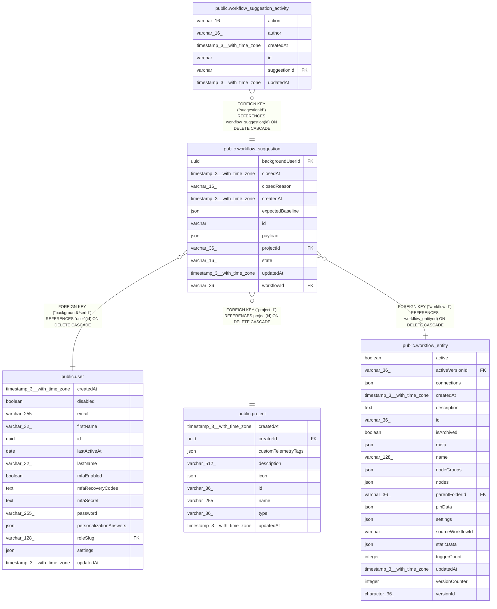

# public.workflow_suggestion

## Columns

| Name | Type | Default | Nullable | Children | Parents | Comment |
| ---- | ---- | ------- | -------- | -------- | ------- | ------- |
| backgroundUserId | uuid |  | false |  | [public.user](public.user.md) | User who enabled the investigation |
| closedAt | timestamp(3) with time zone |  | true |  |  |  |
| closedReason | varchar(16) |  | true |  |  | Reason the suggestion closed |
| createdAt | timestamp(3) with time zone | CURRENT_TIMESTAMP(3) | false |  |  |  |
| expectedBaseline | json |  | false |  |  | Original saved and published version IDs and checksum |
| id | varchar |  | false | [public.workflow_suggestion_activity](public.workflow_suggestion_activity.md) |  |  |
| payload | json |  | false |  |  | Independent baseline, graph, explanation, validation, and error context |
| projectId | varchar(36) |  | false |  | [public.project](public.project.md) | Original owner project |
| state | varchar(16) |  | false |  |  | Suggestion lifecycle state |
| updatedAt | timestamp(3) with time zone | CURRENT_TIMESTAMP(3) | false |  |  |  |
| workflowId | varchar(36) |  | false |  | [public.workflow_entity](public.workflow_entity.md) | Target workflow |

## Constraints

| Name | Type | Definition |
| ---- | ---- | ---------- |
| CHK_workflow_suggestion_closedReason | CHECK | CHECK ((("closedReason")::text = ANY ((ARRAY['outdated'::character varying, 'applied'::character varying, 'discarded'::character varying])::text[]))) |
| CHK_workflow_suggestion_state | CHECK | CHECK (((state)::text = ANY ((ARRAY['pending'::character varying, 'closed'::character varying])::text[]))) |
| FK_0f273c2cd9e1a097a8ba044fe9a | FOREIGN KEY | FOREIGN KEY ("projectId") REFERENCES project(id) ON DELETE CASCADE |
| FK_b415d749769e092f51575def2d2 | FOREIGN KEY | FOREIGN KEY ("backgroundUserId") REFERENCES "user"(id) ON DELETE CASCADE |
| FK_f6289858234727cdff168626dc9 | FOREIGN KEY | FOREIGN KEY ("workflowId") REFERENCES workflow_entity(id) ON DELETE CASCADE |
| PK_529f3c424f40b3174e5e77e1cf3 | PRIMARY KEY | PRIMARY KEY (id) |
| workflow_suggestion_backgroundUserId_not_null | n | NOT NULL "backgroundUserId" |
| workflow_suggestion_createdAt_not_null | n | NOT NULL "createdAt" |
| workflow_suggestion_expectedBaseline_not_null | n | NOT NULL "expectedBaseline" |
| workflow_suggestion_id_not_null | n | NOT NULL id |
| workflow_suggestion_payload_not_null | n | NOT NULL payload |
| workflow_suggestion_projectId_not_null | n | NOT NULL "projectId" |
| workflow_suggestion_state_not_null | n | NOT NULL state |
| workflow_suggestion_updatedAt_not_null | n | NOT NULL "updatedAt" |
| workflow_suggestion_workflowId_not_null | n | NOT NULL "workflowId" |

## Indexes

| Name | Definition |
| ---- | ---------- |
| IDX_0494cd7ecbc83cd7935d88b129 | CREATE INDEX "IDX_0494cd7ecbc83cd7935d88b129" ON public.workflow_suggestion USING btree (state, "closedAt") |
| IDX_0f273c2cd9e1a097a8ba044fe9 | CREATE INDEX "IDX_0f273c2cd9e1a097a8ba044fe9" ON public.workflow_suggestion USING btree ("projectId") |
| IDX_b415d749769e092f51575def2d | CREATE INDEX "IDX_b415d749769e092f51575def2d" ON public.workflow_suggestion USING btree ("backgroundUserId") |
| IDX_f6289858234727cdff168626dc | CREATE INDEX "IDX_f6289858234727cdff168626dc" ON public.workflow_suggestion USING btree ("workflowId") |
| IDX_workflow_suggestion_workflowId | CREATE UNIQUE INDEX "IDX_workflow_suggestion_workflowId" ON public.workflow_suggestion USING btree ("workflowId") WHERE ((state)::text = 'pending'::text) |
| PK_529f3c424f40b3174e5e77e1cf3 | CREATE UNIQUE INDEX "PK_529f3c424f40b3174e5e77e1cf3" ON public.workflow_suggestion USING btree (id) |

## Relations

---

> Generated by [tbls](https://github.com/k1LoW/tbls)
