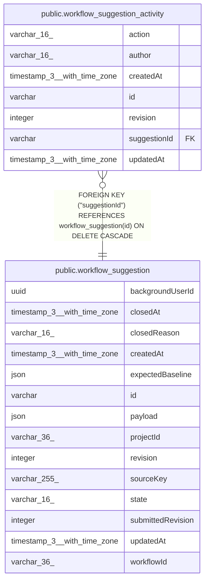

# public.workflow_suggestion_activity

## Columns

| Name | Type | Default | Nullable | Children | Parents | Comment |
| ---- | ---- | ------- | -------- | -------- | ------- | ------- |
| action | varchar(16) |  | false |  |  | Proposal activity action |
| author | varchar(16) |  | false |  |  | Authorship, separate from the background user |
| createdAt | timestamp(3) with time zone | CURRENT_TIMESTAMP(3) | false |  |  |  |
| id | varchar |  | false |  |  |  |
| revision | integer |  | false |  |  |  |
| suggestionId | varchar |  | false |  | [public.workflow_suggestion](public.workflow_suggestion.md) |  |
| updatedAt | timestamp(3) with time zone | CURRENT_TIMESTAMP(3) | false |  |  |  |

## Constraints

| Name | Type | Definition |
| ---- | ---- | ---------- |
| CHK_workflow_suggestion_activity_action | CHECK | CHECK (((action)::text = 'submitted'::text)) |
| CHK_workflow_suggestion_activity_author | CHECK | CHECK (((author)::text = 'assistant'::text)) |
| FK_c9a28e6f7349dc4950aeb858692 | FOREIGN KEY | FOREIGN KEY ("suggestionId") REFERENCES workflow_suggestion(id) ON DELETE CASCADE |
| PK_382a74180d2539b68f5990db193 | PRIMARY KEY | PRIMARY KEY (id) |
| workflow_suggestion_activity_action_not_null | n | NOT NULL action |
| workflow_suggestion_activity_author_not_null | n | NOT NULL author |
| workflow_suggestion_activity_createdAt_not_null | n | NOT NULL "createdAt" |
| workflow_suggestion_activity_id_not_null | n | NOT NULL id |
| workflow_suggestion_activity_revision_not_null | n | NOT NULL revision |
| workflow_suggestion_activity_suggestionId_not_null | n | NOT NULL "suggestionId" |
| workflow_suggestion_activity_updatedAt_not_null | n | NOT NULL "updatedAt" |

## Indexes

| Name | Definition |
| ---- | ---------- |
| IDX_a8ffa8017c56cb2920a47cc92a | CREATE UNIQUE INDEX "IDX_a8ffa8017c56cb2920a47cc92a" ON public.workflow_suggestion_activity USING btree ("suggestionId", action) |
| PK_382a74180d2539b68f5990db193 | CREATE UNIQUE INDEX "PK_382a74180d2539b68f5990db193" ON public.workflow_suggestion_activity USING btree (id) |

## Relations

---

> Generated by [tbls](https://github.com/k1LoW/tbls)
