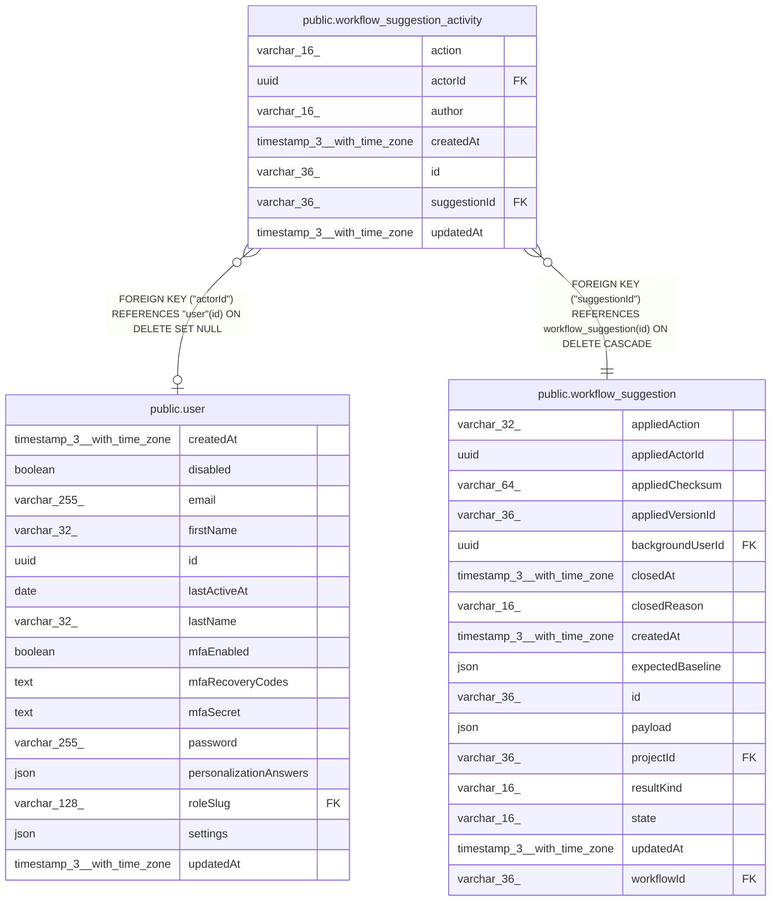

# public.workflow_suggestion_activity

## Columns

| Name | Type | Default | Nullable | Children | Parents | Comment |
| ---- | ---- | ------- | -------- | -------- | ------- | ------- |
| action | varchar(16) |  | false |  |  | Proposal activity action |
| actorId | uuid |  | true |  | [public.user](public.user.md) | Human who took the action; null for Assistant and system activity |
| author | varchar(16) |  | false |  |  | Authorship, separate from the background user |
| createdAt | timestamp(3) with time zone | CURRENT_TIMESTAMP(3) | false |  |  |  |
| id | varchar(36) |  | false |  |  |  |
| suggestionId | varchar(36) |  | false |  | [public.workflow_suggestion](public.workflow_suggestion.md) |  |
| updatedAt | timestamp(3) with time zone | CURRENT_TIMESTAMP(3) | false |  |  |  |

## Constraints

| Name | Type | Definition |
| ---- | ---- | ---------- |
| CHK_workflow_suggestion_activity_action | CHECK | CHECK (((action)::text = ANY ((ARRAY['submitted'::character varying, 'applied'::character varying, 'discarded'::character varying, 'outdated'::character varying, 'published'::character varying, 'publish_failed'::character varying])::text[]))) |
| CHK_workflow_suggestion_activity_author | CHECK | CHECK (((author)::text = ANY ((ARRAY['assistant'::character varying, 'human'::character varying, 'system'::character varying])::text[]))) |
| FK_c9a28e6f7349dc4950aeb858692 | FOREIGN KEY | FOREIGN KEY ("suggestionId") REFERENCES workflow_suggestion(id) ON DELETE CASCADE |
| FK_workflow_suggestion_activity_actor | FOREIGN KEY | FOREIGN KEY ("actorId") REFERENCES "user"(id) ON DELETE SET NULL |
| PK_382a74180d2539b68f5990db193 | PRIMARY KEY | PRIMARY KEY (id) |
| workflow_suggestion_activity_action_not_null | n | NOT NULL action |
| workflow_suggestion_activity_author_not_null | n | NOT NULL author |
| workflow_suggestion_activity_createdAt_not_null | n | NOT NULL "createdAt" |
| workflow_suggestion_activity_id_not_null | n | NOT NULL id |
| workflow_suggestion_activity_suggestionId_not_null | n | NOT NULL "suggestionId" |
| workflow_suggestion_activity_updatedAt_not_null | n | NOT NULL "updatedAt" |

## Indexes

| Name | Definition |
| ---- | ---------- |
| IDX_a8ffa8017c56cb2920a47cc92a | CREATE UNIQUE INDEX "IDX_a8ffa8017c56cb2920a47cc92a" ON public.workflow_suggestion_activity USING btree ("suggestionId", action) |
| IDX_workflow_suggestion_activity_actorId | CREATE INDEX "IDX_workflow_suggestion_activity_actorId" ON public.workflow_suggestion_activity USING btree ("actorId") |
| PK_382a74180d2539b68f5990db193 | CREATE UNIQUE INDEX "PK_382a74180d2539b68f5990db193" ON public.workflow_suggestion_activity USING btree (id) |

## Relations

```mermaid
erDiagram

"public.workflow_suggestion_activity" }o--o| "public.user" : "FOREIGN KEY (#quot;actorId#quot;) REFERENCES #quot;user#quot;(id) ON DELETE SET NULL"
"public.workflow_suggestion_activity" }o--|| "public.workflow_suggestion" : "FOREIGN KEY (#quot;suggestionId#quot;) REFERENCES workflow_suggestion(id) ON DELETE CASCADE"

"public.workflow_suggestion_activity" {
  varchar_16_ action
  uuid actorId FK
  varchar_16_ author
  timestamp_3__with_time_zone createdAt
  varchar_36_ id
  varchar_36_ suggestionId FK
  timestamp_3__with_time_zone updatedAt
}
"public.user" {
  timestamp_3__with_time_zone createdAt
  boolean disabled
  varchar_255_ email
  varchar_32_ firstName
  uuid id
  date lastActiveAt
  varchar_32_ lastName
  boolean mfaEnabled
  text mfaRecoveryCodes
  text mfaSecret
  varchar_255_ password
  json personalizationAnswers
  varchar_128_ roleSlug FK
  json settings
  timestamp_3__with_time_zone updatedAt
}
"public.workflow_suggestion" {
  varchar_32_ appliedAction
  uuid appliedActorId
  varchar_64_ appliedChecksum
  varchar_36_ appliedVersionId
  uuid backgroundUserId FK
  timestamp_3__with_time_zone closedAt
  varchar_16_ closedReason
  timestamp_3__with_time_zone createdAt
  json expectedBaseline
  varchar_36_ id
  json payload
  varchar_36_ projectId FK
  varchar_16_ resultKind
  varchar_16_ state
  timestamp_3__with_time_zone updatedAt
  varchar_36_ workflowId FK
}
```

---

> Generated by [tbls](https://github.com/k1LoW/tbls)
