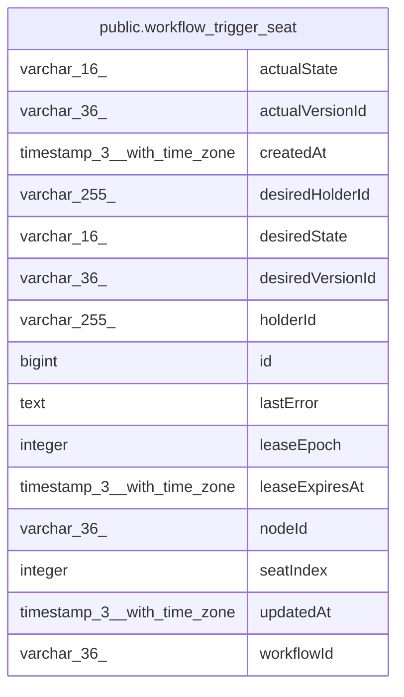

# public.workflow_trigger_seat

## Columns

| Name | Type | Default | Nullable | Children | Parents | Comment |
| ---- | ---- | ------- | -------- | -------- | ------- | ------- |
| actualState | varchar(16) |  | true |  |  | What the holder last reported doing with the seat. |
| actualVersionId | varchar(36) |  | true |  |  | The version the holder’s registered trigger is actually running. |
| createdAt | timestamp(3) with time zone | CURRENT_TIMESTAMP(3) | false |  |  |  |
| desiredHolderId | varchar(255) |  | true |  |  | Handoff request: an underloaded runner asking the holder to release. |
| desiredState | varchar(16) | 'active'::character varying | false |  |  | Whether a runner should serve this seat; publication flips it instead of deleting rows so holders tear down cleanly. |
| desiredVersionId | varchar(36) |  | false |  |  | The published version the seat’s trigger should run. |
| holderId | varchar(255) |  | true |  |  | Runner currently holding the lease; NULL when vacant. |
| id | bigint |  | false |  |  |  |
| lastError | text |  | true |  |  |  |
| leaseEpoch | integer | 0 | false |  |  | Fencing token bumped on every claim; execution inserts are guarded on it so a stale holder’s emissions never land. |
| leaseExpiresAt | timestamp(3) with time zone |  | true |  |  | When the current lease may be reclaimed by another runner. |
| nodeId | varchar(36) |  | false |  |  |  |
| seatIndex | integer |  | false |  |  | Which of the trigger node’s N replica slots this row is. |
| updatedAt | timestamp(3) with time zone | CURRENT_TIMESTAMP(3) | false |  |  |  |
| workflowId | varchar(36) |  | false |  |  |  |

## Constraints

| Name | Type | Definition |
| ---- | ---- | ---------- |
| CHK_workflow_trigger_seat_actualState | CHECK | CHECK ((("actualState")::text = ANY ((ARRAY['registered'::character varying, 'closed'::character varying, 'error'::character varying])::text[]))) |
| CHK_workflow_trigger_seat_desiredState | CHECK | CHECK ((("desiredState")::text = ANY ((ARRAY['active'::character varying, 'inactive'::character varying])::text[]))) |
| PK_d88e285cade3e5f2bb626a071f1 | PRIMARY KEY | PRIMARY KEY (id) |
| workflow_trigger_seat_createdAt_not_null | n | NOT NULL "createdAt" |
| workflow_trigger_seat_desiredState_not_null | n | NOT NULL "desiredState" |
| workflow_trigger_seat_desiredVersionId_not_null | n | NOT NULL "desiredVersionId" |
| workflow_trigger_seat_id_not_null | n | NOT NULL id |
| workflow_trigger_seat_leaseEpoch_not_null | n | NOT NULL "leaseEpoch" |
| workflow_trigger_seat_nodeId_not_null | n | NOT NULL "nodeId" |
| workflow_trigger_seat_seatIndex_not_null | n | NOT NULL "seatIndex" |
| workflow_trigger_seat_updatedAt_not_null | n | NOT NULL "updatedAt" |
| workflow_trigger_seat_workflowId_not_null | n | NOT NULL "workflowId" |

## Indexes

| Name | Definition |
| ---- | ---------- |
| IDX_workflow_trigger_seat_desiredState | CREATE INDEX "IDX_workflow_trigger_seat_desiredState" ON public.workflow_trigger_seat USING btree ("desiredState") |
| IDX_workflow_trigger_seat_workflowId_nodeId_seatIndex | CREATE UNIQUE INDEX "IDX_workflow_trigger_seat_workflowId_nodeId_seatIndex" ON public.workflow_trigger_seat USING btree ("workflowId", "nodeId", "seatIndex") |
| PK_d88e285cade3e5f2bb626a071f1 | CREATE UNIQUE INDEX "PK_d88e285cade3e5f2bb626a071f1" ON public.workflow_trigger_seat USING btree (id) |

## Relations

---

> Generated by [tbls](https://github.com/k1LoW/tbls)
