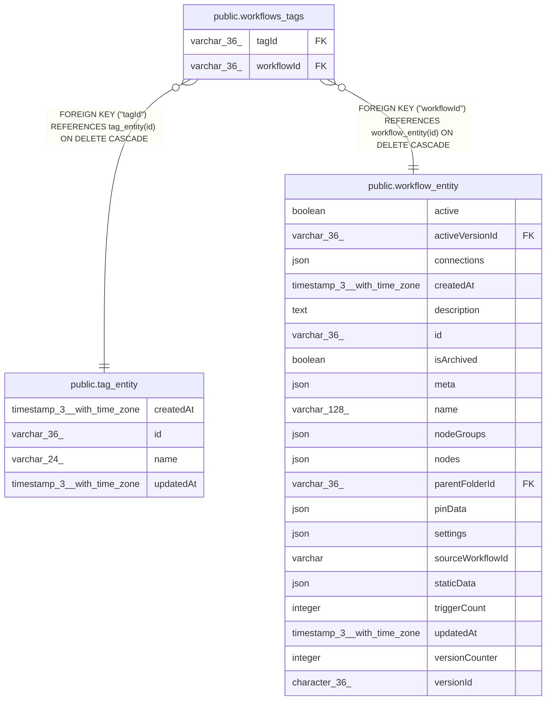

# public.workflows_tags

## Columns

| Name | Type | Default | Nullable | Children | Parents | Comment |
| ---- | ---- | ------- | -------- | -------- | ------- | ------- |
| tagId | varchar(36) |  | false |  | [public.tag_entity](public.tag_entity.md) |  |
| workflowId | varchar(36) |  | false |  | [public.workflow_entity](public.workflow_entity.md) |  |

## Constraints

| Name | Type | Definition |
| ---- | ---- | ---------- |
| fk_workflows_tags_tag_id | FOREIGN KEY | FOREIGN KEY ("tagId") REFERENCES tag_entity(id) ON DELETE CASCADE |
| fk_workflows_tags_workflow_id | FOREIGN KEY | FOREIGN KEY ("workflowId") REFERENCES workflow_entity(id) ON DELETE CASCADE |
| pk_workflows_tags | PRIMARY KEY | PRIMARY KEY ("workflowId", "tagId") |
| workflows_tags_tagId_not_null1 | n | NOT NULL "tagId" |
| workflows_tags_workflowId_not_null1 | n | NOT NULL "workflowId" |

## Indexes

| Name | Definition |
| ---- | ---------- |
| idx_workflows_tags_workflow_id | CREATE INDEX idx_workflows_tags_workflow_id ON public.workflows_tags USING btree ("workflowId") |
| pk_workflows_tags | CREATE UNIQUE INDEX pk_workflows_tags ON public.workflows_tags USING btree ("workflowId", "tagId") |

## Relations

---

> Generated by [tbls](https://github.com/k1LoW/tbls)
