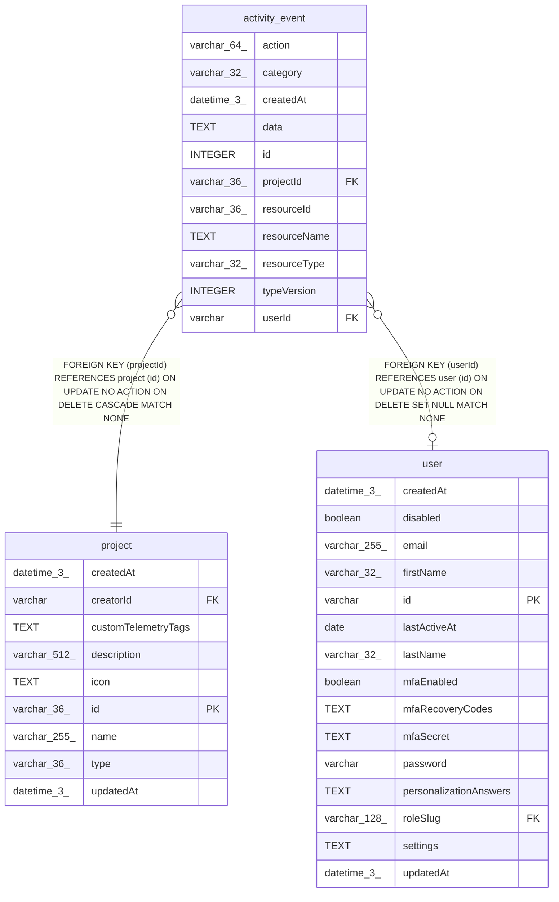

# activity_event

## Description

<details>
<summary><strong>Table Definition</strong></summary>

```sql
CREATE TABLE "activity_event" ("id" integer PRIMARY KEY NOT NULL, "category" varchar(32) NOT NULL, "action" varchar(64) NOT NULL, "typeVersion" integer NOT NULL DEFAULT (1), "userId" varchar, "projectId" varchar(36) NOT NULL, "resourceType" varchar(32), "resourceId" varchar(36), "resourceName" text, "data" text, "createdAt" datetime(3) NOT NULL DEFAULT (STRFTIME('%Y-%m-%d %H:%M:%f', 'NOW')), CONSTRAINT "FK_29654477f37189453b353d3f46a" FOREIGN KEY ("userId") REFERENCES "user" ("id") ON DELETE SET NULL, CONSTRAINT "FK_6bf94d5542661d2e1b9e0c41436" FOREIGN KEY ("projectId") REFERENCES "project" ("id") ON DELETE CASCADE)
```

</details>

## Columns

| Name | Type | Default | Nullable | Children | Parents | Comment |
| ---- | ---- | ------- | -------- | -------- | ------- | ------- |
| action | varchar(64) |  | false |  |  |  |
| category | varchar(32) |  | false |  |  |  |
| createdAt | datetime(3) | STRFTIME('%Y-%m-%d %H:%M:%f', 'NOW') | false |  |  |  |
| data | TEXT |  | true |  |  |  |
| id | INTEGER |  | false |  |  |  |
| projectId | varchar(36) |  | false |  | [project](project.md) |  |
| resourceId | varchar(36) |  | true |  |  |  |
| resourceName | TEXT |  | true |  |  |  |
| resourceType | varchar(32) |  | true |  |  |  |
| typeVersion | INTEGER | 1 | false |  |  |  |
| userId | varchar |  | true |  | [user](user.md) |  |

## Constraints

| Name | Type | Definition |
| ---- | ---- | ---------- |
| - (Foreign key ID: 0) | FOREIGN KEY | FOREIGN KEY (projectId) REFERENCES project (id) ON UPDATE NO ACTION ON DELETE CASCADE MATCH NONE |
| - (Foreign key ID: 1) | FOREIGN KEY | FOREIGN KEY (userId) REFERENCES user (id) ON UPDATE NO ACTION ON DELETE SET NULL MATCH NONE |
| id | PRIMARY KEY | PRIMARY KEY (id) |

## Indexes

| Name | Definition |
| ---- | ---------- |
| IDX_activity_event_project | CREATE INDEX "IDX_activity_event_project" ON "activity_event" ("projectId", "id")  |
| IDX_activity_event_resource | CREATE INDEX "IDX_activity_event_resource" ON "activity_event" ("resourceType", "resourceId", "id")  |
| IDX_activity_event_user | CREATE INDEX "IDX_activity_event_user" ON "activity_event" ("userId", "id")  |

## Relations



---

> Generated by [tbls](https://github.com/k1LoW/tbls)
