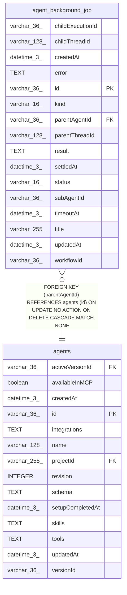

# agent_background_job

## Description

<details>
<summary><strong>Table Definition</strong></summary>

```sql
CREATE TABLE "agent_background_job" ("id" varchar(36) PRIMARY KEY NOT NULL, "kind" varchar(16) NOT NULL, "status" varchar(16) NOT NULL, "parentAgentId" varchar(36) NOT NULL, "parentThreadId" varchar(128) NOT NULL, "title" varchar(255) NOT NULL, "subAgentId" varchar(36), "childThreadId" varchar(128), "childExecutionId" varchar(36), "workflowId" varchar(36), "timeoutAt" datetime(3), "result" text, "error" text, "settledAt" datetime(3), "createdAt" datetime(3) NOT NULL DEFAULT (STRFTIME('%Y-%m-%d %H:%M:%f', 'NOW')), "updatedAt" datetime(3) NOT NULL DEFAULT (STRFTIME('%Y-%m-%d %H:%M:%f', 'NOW')), CONSTRAINT "CHK_agent_background_job_kind" CHECK ("kind" IN ('subagent', 'workflow')), CONSTRAINT "CHK_agent_background_job_status" CHECK ("status" IN ('running', 'completed', 'failed', 'cancelled')), CONSTRAINT "FK_d46c6f00730c2ef8bcb6ee24b67" FOREIGN KEY ("parentAgentId") REFERENCES "agents" ("id") ON DELETE CASCADE)
```

</details>

## Columns

| Name | Type | Default | Nullable | Children | Parents | Comment |
| ---- | ---- | ------- | -------- | -------- | ------- | ------- |
| childExecutionId | varchar(36) |  | true |  |  |  |
| childThreadId | varchar(128) |  | true |  |  |  |
| createdAt | datetime(3) | STRFTIME('%Y-%m-%d %H:%M:%f', 'NOW') | false |  |  |  |
| error | TEXT |  | true |  |  |  |
| id | varchar(36) |  | false |  |  |  |
| kind | varchar(16) |  | false |  |  |  |
| parentAgentId | varchar(36) |  | false |  | [agents](agents.md) |  |
| parentThreadId | varchar(128) |  | false |  |  |  |
| result | TEXT |  | true |  |  |  |
| settledAt | datetime(3) |  | true |  |  |  |
| status | varchar(16) |  | false |  |  |  |
| subAgentId | varchar(36) |  | true |  |  |  |
| timeoutAt | datetime(3) |  | true |  |  |  |
| title | varchar(255) |  | false |  |  |  |
| updatedAt | datetime(3) | STRFTIME('%Y-%m-%d %H:%M:%f', 'NOW') | false |  |  |  |
| workflowId | varchar(36) |  | true |  |  |  |

## Constraints

| Name | Type | Definition |
| ---- | ---- | ---------- |
| - | CHECK | CHECK ("kind" IN ('subagent', 'workflow')) |
| - | CHECK | CHECK ("status" IN ('running', 'completed', 'failed', 'cancelled')) |
| - (Foreign key ID: 0) | FOREIGN KEY | FOREIGN KEY (parentAgentId) REFERENCES agents (id) ON UPDATE NO ACTION ON DELETE CASCADE MATCH NONE |
| id | PRIMARY KEY | PRIMARY KEY (id) |
| sqlite_autoindex_agent_background_job_1 | PRIMARY KEY | PRIMARY KEY (id) |

## Indexes

| Name | Definition |
| ---- | ---------- |
| IDX_93d62baabe9858816b5adafb44 | CREATE INDEX "IDX_93d62baabe9858816b5adafb44" ON "agent_background_job" ("parentThreadId", "status")  |
| IDX_agent_background_job_childExecutionId | CREATE UNIQUE INDEX "IDX_agent_background_job_childExecutionId" ON "agent_background_job" ("childExecutionId") WHERE "childExecutionId" IS NOT NULL |
| IDX_agent_background_job_timeoutAt | CREATE INDEX "IDX_agent_background_job_timeoutAt" ON "agent_background_job" ("timeoutAt") WHERE "status" = 'running' |
| IDX_d46c6f00730c2ef8bcb6ee24b6 | CREATE INDEX "IDX_d46c6f00730c2ef8bcb6ee24b6" ON "agent_background_job" ("parentAgentId")  |
| IDX_e43e630272995a93dfeb94ab3e | CREATE INDEX "IDX_e43e630272995a93dfeb94ab3e" ON "agent_background_job" ("settledAt")  |
| sqlite_autoindex_agent_background_job_1 | PRIMARY KEY (id) |

## Relations



---

> Generated by [tbls](https://github.com/k1LoW/tbls)
