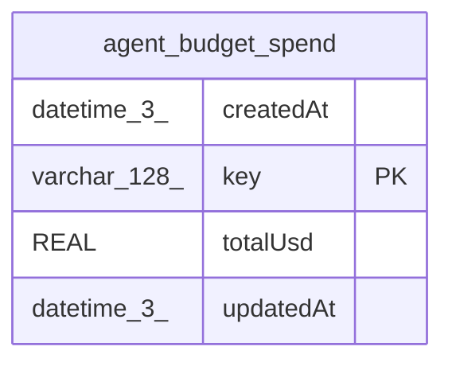

# agent_budget_spend

## Description

<details>
<summary><strong>Table Definition</strong></summary>

```sql
CREATE TABLE "agent_budget_spend" ("key" varchar(128) PRIMARY KEY NOT NULL, "totalUsd" real NOT NULL DEFAULT (0), "createdAt" datetime(3) NOT NULL DEFAULT (STRFTIME('%Y-%m-%d %H:%M:%f', 'NOW')), "updatedAt" datetime(3) NOT NULL DEFAULT (STRFTIME('%Y-%m-%d %H:%M:%f', 'NOW')), CONSTRAINT "CHK_agent_budget_spend_total_usd_non_negative" CHECK ("totalUsd" >= 0))
```

</details>

## Columns

| Name | Type | Default | Nullable | Children | Parents | Comment |
| ---- | ---- | ------- | -------- | -------- | ------- | ------- |
| createdAt | datetime(3) | STRFTIME('%Y-%m-%d %H:%M:%f', 'NOW') | false |  |  |  |
| key | varchar(128) |  | false |  |  |  |
| totalUsd | REAL | 0 | false |  |  |  |
| updatedAt | datetime(3) | STRFTIME('%Y-%m-%d %H:%M:%f', 'NOW') | false |  |  |  |

## Constraints

| Name | Type | Definition |
| ---- | ---- | ---------- |
| - | CHECK | CHECK ("totalUsd" >= 0) |
| key | PRIMARY KEY | PRIMARY KEY (key) |
| sqlite_autoindex_agent_budget_spend_1 | PRIMARY KEY | PRIMARY KEY (key) |

## Indexes

| Name | Definition |
| ---- | ---------- |
| sqlite_autoindex_agent_budget_spend_1 | PRIMARY KEY (key) |

## Relations



---

> Generated by [tbls](https://github.com/k1LoW/tbls)
