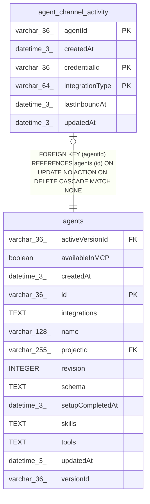

# agent_channel_activity

## Description

<details>
<summary><strong>Table Definition</strong></summary>

```sql
CREATE TABLE "agent_channel_activity" ("agentId" varchar(36) NOT NULL, "integrationType" varchar(64) NOT NULL, "credentialId" varchar(36) NOT NULL, "lastInboundAt" datetime(3) NOT NULL, "createdAt" datetime(3) NOT NULL DEFAULT (STRFTIME('%Y-%m-%d %H:%M:%f', 'NOW')), "updatedAt" datetime(3) NOT NULL DEFAULT (STRFTIME('%Y-%m-%d %H:%M:%f', 'NOW')), CONSTRAINT "FK_7ce2281cac622a5d634663dfa69" FOREIGN KEY ("agentId") REFERENCES "agents" ("id") ON DELETE CASCADE, PRIMARY KEY ("agentId", "integrationType", "credentialId"))
```

</details>

## Columns

| Name | Type | Default | Nullable | Children | Parents | Comment |
| ---- | ---- | ------- | -------- | -------- | ------- | ------- |
| agentId | varchar(36) |  | false |  | [agents](agents.md) |  |
| createdAt | datetime(3) | STRFTIME('%Y-%m-%d %H:%M:%f', 'NOW') | false |  |  |  |
| credentialId | varchar(36) |  | false |  |  |  |
| integrationType | varchar(64) |  | false |  |  |  |
| lastInboundAt | datetime(3) |  | false |  |  |  |
| updatedAt | datetime(3) | STRFTIME('%Y-%m-%d %H:%M:%f', 'NOW') | false |  |  |  |

## Constraints

| Name | Type | Definition |
| ---- | ---- | ---------- |
| - (Foreign key ID: 0) | FOREIGN KEY | FOREIGN KEY (agentId) REFERENCES agents (id) ON UPDATE NO ACTION ON DELETE CASCADE MATCH NONE |
| agentId | PRIMARY KEY | PRIMARY KEY (agentId) |
| credentialId | PRIMARY KEY | PRIMARY KEY (credentialId) |
| integrationType | PRIMARY KEY | PRIMARY KEY (integrationType) |
| sqlite_autoindex_agent_channel_activity_1 | PRIMARY KEY | PRIMARY KEY (agentId, integrationType, credentialId) |

## Indexes

| Name | Definition |
| ---- | ---------- |
| sqlite_autoindex_agent_channel_activity_1 | PRIMARY KEY (agentId, integrationType, credentialId) |

## Relations



---

> Generated by [tbls](https://github.com/k1LoW/tbls)
