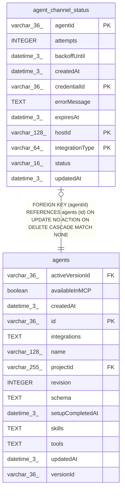

# agent_channel_status

## Description

<details>
<summary><strong>Table Definition</strong></summary>

```sql
CREATE TABLE "agent_channel_status" ("agentId" varchar(36) NOT NULL, "integrationType" varchar(64) NOT NULL, "credentialId" varchar(36) NOT NULL, "hostId" varchar(128) NOT NULL, "status" varchar(16) NOT NULL, "errorMessage" text, "attempts" integer NOT NULL DEFAULT (0), "backoffUntil" datetime(3), "expiresAt" datetime(3), "createdAt" datetime(3) NOT NULL DEFAULT (STRFTIME('%Y-%m-%d %H:%M:%f', 'NOW')), "updatedAt" datetime(3) NOT NULL DEFAULT (STRFTIME('%Y-%m-%d %H:%M:%f', 'NOW')), CONSTRAINT "CHK_agent_channel_status_status" CHECK ("status" IN ('connected', 'error')), CONSTRAINT "FK_7a723e6aad04d88057dea6a21f4" FOREIGN KEY ("agentId") REFERENCES "agents" ("id") ON DELETE CASCADE, PRIMARY KEY ("agentId", "integrationType", "credentialId", "hostId"))
```

</details>

## Columns

| Name | Type | Default | Nullable | Children | Parents | Comment |
| ---- | ---- | ------- | -------- | -------- | ------- | ------- |
| agentId | varchar(36) |  | false |  | [agents](agents.md) |  |
| attempts | INTEGER | 0 | false |  |  |  |
| backoffUntil | datetime(3) |  | true |  |  |  |
| createdAt | datetime(3) | STRFTIME('%Y-%m-%d %H:%M:%f', 'NOW') | false |  |  |  |
| credentialId | varchar(36) |  | false |  |  |  |
| errorMessage | TEXT |  | true |  |  |  |
| expiresAt | datetime(3) |  | true |  |  |  |
| hostId | varchar(128) |  | false |  |  |  |
| integrationType | varchar(64) |  | false |  |  |  |
| status | varchar(16) |  | false |  |  |  |
| updatedAt | datetime(3) | STRFTIME('%Y-%m-%d %H:%M:%f', 'NOW') | false |  |  |  |

## Constraints

| Name | Type | Definition |
| ---- | ---- | ---------- |
| - | CHECK | CHECK ("status" IN ('connected', 'error')) |
| - (Foreign key ID: 0) | FOREIGN KEY | FOREIGN KEY (agentId) REFERENCES agents (id) ON UPDATE NO ACTION ON DELETE CASCADE MATCH NONE |
| agentId | PRIMARY KEY | PRIMARY KEY (agentId) |
| credentialId | PRIMARY KEY | PRIMARY KEY (credentialId) |
| hostId | PRIMARY KEY | PRIMARY KEY (hostId) |
| integrationType | PRIMARY KEY | PRIMARY KEY (integrationType) |
| sqlite_autoindex_agent_channel_status_1 | PRIMARY KEY | PRIMARY KEY (agentId, integrationType, credentialId, hostId) |

## Indexes

| Name | Definition |
| ---- | ---------- |
| IDX_a7c67724df9ef3d12f6da773c1 | CREATE INDEX "IDX_a7c67724df9ef3d12f6da773c1" ON "agent_channel_status" ("expiresAt")  |
| IDX_c75ec632fe0b5b1905edb9cd7f | CREATE INDEX "IDX_c75ec632fe0b5b1905edb9cd7f" ON "agent_channel_status" ("hostId")  |
| sqlite_autoindex_agent_channel_status_1 | PRIMARY KEY (agentId, integrationType, credentialId, hostId) |

## Relations



---

> Generated by [tbls](https://github.com/k1LoW/tbls)
