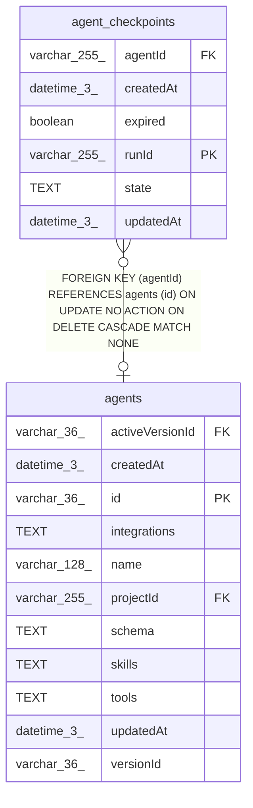

# agent_checkpoints

## Description

<details>
<summary><strong>Table Definition</strong></summary>

```sql
CREATE TABLE "agent_checkpoints" ("runId" varchar(255) PRIMARY KEY NOT NULL, "agentId" varchar(255), "state" text, "expired" boolean NOT NULL DEFAULT (false), "createdAt" datetime(3) NOT NULL DEFAULT (STRFTIME('%Y-%m-%d %H:%M:%f', 'NOW')), "updatedAt" datetime(3) NOT NULL DEFAULT (STRFTIME('%Y-%m-%d %H:%M:%f', 'NOW')), CONSTRAINT "FK_5e31c210f896d539964bf99fe32" FOREIGN KEY ("agentId") REFERENCES "agents" ("id") ON DELETE CASCADE)
```

</details>

## Columns

| Name | Type | Default | Nullable | Children | Parents | Comment |
| ---- | ---- | ------- | -------- | -------- | ------- | ------- |
| agentId | varchar(255) |  | true |  | [agents](agents.md) |  |
| createdAt | datetime(3) | STRFTIME('%Y-%m-%d %H:%M:%f', 'NOW') | false |  |  |  |
| expired | boolean | false | false |  |  |  |
| runId | varchar(255) |  | false |  |  |  |
| state | TEXT |  | true |  |  |  |
| updatedAt | datetime(3) | STRFTIME('%Y-%m-%d %H:%M:%f', 'NOW') | false |  |  |  |

## Constraints

| Name | Type | Definition |
| ---- | ---- | ---------- |
| - (Foreign key ID: 0) | FOREIGN KEY | FOREIGN KEY (agentId) REFERENCES agents (id) ON UPDATE NO ACTION ON DELETE CASCADE MATCH NONE |
| runId | PRIMARY KEY | PRIMARY KEY (runId) |
| sqlite_autoindex_agent_checkpoints_1 | PRIMARY KEY | PRIMARY KEY (runId) |

## Indexes

| Name | Definition |
| ---- | ---------- |
| IDX_5e31c210f896d539964bf99fe3 | CREATE INDEX "IDX_5e31c210f896d539964bf99fe3" ON "agent_checkpoints" ("agentId")  |
| sqlite_autoindex_agent_checkpoints_1 | PRIMARY KEY (runId) |

## Relations



---

> Generated by [tbls](https://github.com/k1LoW/tbls)
