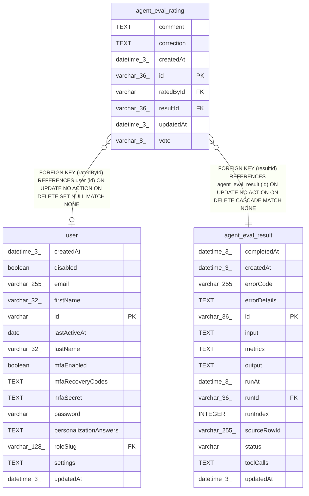

# agent_eval_rating

## Description

<details>
<summary><strong>Table Definition</strong></summary>

```sql
CREATE TABLE "agent_eval_rating" ("id" varchar(36) PRIMARY KEY NOT NULL, "resultId" varchar(36) NOT NULL, "vote" varchar(8) NOT NULL, "comment" text, "correction" text, "ratedById" varchar, "createdAt" datetime(3) NOT NULL DEFAULT (STRFTIME('%Y-%m-%d %H:%M:%f', 'NOW')), "updatedAt" datetime(3) NOT NULL DEFAULT (STRFTIME('%Y-%m-%d %H:%M:%f', 'NOW')), CONSTRAINT "CHK_agent_eval_rating_vote" CHECK ("vote" IN ('up', 'down')), CONSTRAINT "FK_9cadae6591c64498f1b58a2cef3" FOREIGN KEY ("resultId") REFERENCES "agent_eval_result" ("id") ON DELETE CASCADE, CONSTRAINT "FK_e06a7408573a3e152e673977d2c" FOREIGN KEY ("ratedById") REFERENCES "user" ("id") ON DELETE SET NULL)
```

</details>

## Columns

| Name | Type | Default | Nullable | Children | Parents | Comment |
| ---- | ---- | ------- | -------- | -------- | ------- | ------- |
| comment | TEXT |  | true |  |  |  |
| correction | TEXT |  | true |  |  |  |
| createdAt | datetime(3) | STRFTIME('%Y-%m-%d %H:%M:%f', 'NOW') | false |  |  |  |
| id | varchar(36) |  | false |  |  |  |
| ratedById | varchar |  | true |  | [user](user.md) |  |
| resultId | varchar(36) |  | false |  | [agent_eval_result](agent_eval_result.md) |  |
| updatedAt | datetime(3) | STRFTIME('%Y-%m-%d %H:%M:%f', 'NOW') | false |  |  |  |
| vote | varchar(8) |  | false |  |  |  |

## Constraints

| Name | Type | Definition |
| ---- | ---- | ---------- |
| - | CHECK | CHECK ("vote" IN ('up', 'down')) |
| - (Foreign key ID: 0) | FOREIGN KEY | FOREIGN KEY (ratedById) REFERENCES user (id) ON UPDATE NO ACTION ON DELETE SET NULL MATCH NONE |
| - (Foreign key ID: 1) | FOREIGN KEY | FOREIGN KEY (resultId) REFERENCES agent_eval_result (id) ON UPDATE NO ACTION ON DELETE CASCADE MATCH NONE |
| id | PRIMARY KEY | PRIMARY KEY (id) |
| sqlite_autoindex_agent_eval_rating_1 | PRIMARY KEY | PRIMARY KEY (id) |

## Indexes

| Name | Definition |
| ---- | ---------- |
| IDX_9cadae6591c64498f1b58a2cef | CREATE INDEX "IDX_9cadae6591c64498f1b58a2cef" ON "agent_eval_rating" ("resultId")  |
| sqlite_autoindex_agent_eval_rating_1 | PRIMARY KEY (id) |

## Relations



---

> Generated by [tbls](https://github.com/k1LoW/tbls)
