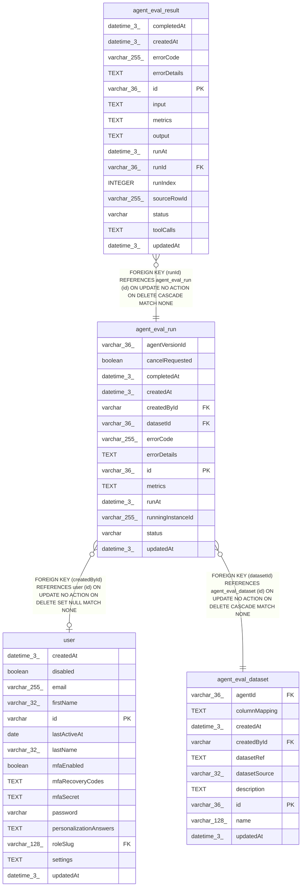

# agent_eval_run

## Description

<details>
<summary><strong>Table Definition</strong></summary>

```sql
CREATE TABLE "agent_eval_run" ("id" varchar(36) PRIMARY KEY NOT NULL, "datasetId" varchar(36) NOT NULL, "agentVersionId" varchar(36), "status" varchar NOT NULL, "runAt" datetime(3), "completedAt" datetime(3), "metrics" text, "errorCode" varchar(255), "errorDetails" text, "runningInstanceId" varchar(255), "cancelRequested" boolean NOT NULL DEFAULT (false), "createdById" varchar, "createdAt" datetime(3) NOT NULL DEFAULT (STRFTIME('%Y-%m-%d %H:%M:%f', 'NOW')), "updatedAt" datetime(3) NOT NULL DEFAULT (STRFTIME('%Y-%m-%d %H:%M:%f', 'NOW')), CONSTRAINT "CHK_agent_eval_run_status" CHECK ("status" IN ('new', 'running', 'completed', 'error', 'cancelled')), CONSTRAINT "FK_39ca447735d378e365f4227abff" FOREIGN KEY ("datasetId") REFERENCES "agent_eval_dataset" ("id") ON DELETE CASCADE, CONSTRAINT "FK_54ee897f442cc7393a6d6165334" FOREIGN KEY ("createdById") REFERENCES "user" ("id") ON DELETE SET NULL)
```

</details>

## Columns

| Name | Type | Default | Nullable | Children | Parents | Comment |
| ---- | ---- | ------- | -------- | -------- | ------- | ------- |
| agentVersionId | varchar(36) |  | true |  |  |  |
| cancelRequested | boolean | false | false |  |  |  |
| completedAt | datetime(3) |  | true |  |  |  |
| createdAt | datetime(3) | STRFTIME('%Y-%m-%d %H:%M:%f', 'NOW') | false |  |  |  |
| createdById | varchar |  | true |  | [user](user.md) |  |
| datasetId | varchar(36) |  | false |  | [agent_eval_dataset](agent_eval_dataset.md) |  |
| errorCode | varchar(255) |  | true |  |  |  |
| errorDetails | TEXT |  | true |  |  |  |
| id | varchar(36) |  | false | [agent_eval_result](agent_eval_result.md) |  |  |
| metrics | TEXT |  | true |  |  |  |
| runAt | datetime(3) |  | true |  |  |  |
| runningInstanceId | varchar(255) |  | true |  |  |  |
| status | varchar |  | false |  |  |  |
| updatedAt | datetime(3) | STRFTIME('%Y-%m-%d %H:%M:%f', 'NOW') | false |  |  |  |

## Constraints

| Name | Type | Definition |
| ---- | ---- | ---------- |
| - | CHECK | CHECK ("status" IN ('new', 'running', 'completed', 'error', 'cancelled')) |
| - (Foreign key ID: 0) | FOREIGN KEY | FOREIGN KEY (createdById) REFERENCES user (id) ON UPDATE NO ACTION ON DELETE SET NULL MATCH NONE |
| - (Foreign key ID: 1) | FOREIGN KEY | FOREIGN KEY (datasetId) REFERENCES agent_eval_dataset (id) ON UPDATE NO ACTION ON DELETE CASCADE MATCH NONE |
| id | PRIMARY KEY | PRIMARY KEY (id) |
| sqlite_autoindex_agent_eval_run_1 | PRIMARY KEY | PRIMARY KEY (id) |

## Indexes

| Name | Definition |
| ---- | ---------- |
| IDX_39ca447735d378e365f4227abf | CREATE INDEX "IDX_39ca447735d378e365f4227abf" ON "agent_eval_run" ("datasetId")  |
| sqlite_autoindex_agent_eval_run_1 | PRIMARY KEY (id) |

## Relations



---

> Generated by [tbls](https://github.com/k1LoW/tbls)
