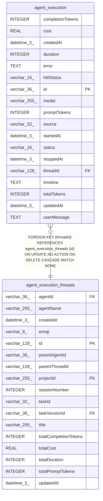

# agent_execution

## Description

<details>
<summary><strong>Table Definition</strong></summary>

```sql
CREATE TABLE "agent_execution" ("id" varchar(36) PRIMARY KEY NOT NULL, "threadId" varchar(128) NOT NULL, "status" varchar(16) NOT NULL, "startedAt" datetime(3), "stoppedAt" datetime(3), "duration" integer NOT NULL DEFAULT (0), "userMessage" text, "model" varchar(255), "promptTokens" integer, "completionTokens" integer, "totalTokens" integer, "cost" real, "timeline" text, "error" text, "hitlStatus" varchar(16), "source" varchar(32), "createdAt" datetime(3) NOT NULL DEFAULT (STRFTIME('%Y-%m-%d %H:%M:%f', 'NOW')), "updatedAt" datetime(3) NOT NULL DEFAULT (STRFTIME('%Y-%m-%d %H:%M:%f', 'NOW')), CONSTRAINT "CHK_agent_execution_status" CHECK (((("status" IN ('success', 'error'))))), CONSTRAINT "CHK_agent_execution_hitlStatus" CHECK (((("hitlStatus" IN ('suspended', 'resumed'))))), CONSTRAINT "FK_add2432fb6034cc18b6af299dce" FOREIGN KEY ("threadId") REFERENCES "agent_execution_threads" ("id") ON DELETE CASCADE ON UPDATE NO ACTION)
```

</details>

## Columns

| Name | Type | Default | Nullable | Children | Parents | Comment |
| ---- | ---- | ------- | -------- | -------- | ------- | ------- |
| completionTokens | INTEGER |  | true |  |  |  |
| cost | REAL |  | true |  |  |  |
| createdAt | datetime(3) | STRFTIME('%Y-%m-%d %H:%M:%f', 'NOW') | false |  |  |  |
| duration | INTEGER | 0 | false |  |  |  |
| error | TEXT |  | true |  |  |  |
| hitlStatus | varchar(16) |  | true |  |  |  |
| id | varchar(36) |  | false |  |  |  |
| model | varchar(255) |  | true |  |  |  |
| promptTokens | INTEGER |  | true |  |  |  |
| source | varchar(32) |  | true |  |  |  |
| startedAt | datetime(3) |  | true |  |  |  |
| status | varchar(16) |  | false |  |  |  |
| stoppedAt | datetime(3) |  | true |  |  |  |
| threadId | varchar(128) |  | false |  | [agent_execution_threads](agent_execution_threads.md) |  |
| timeline | TEXT |  | true |  |  |  |
| totalTokens | INTEGER |  | true |  |  |  |
| updatedAt | datetime(3) | STRFTIME('%Y-%m-%d %H:%M:%f', 'NOW') | false |  |  |  |
| userMessage | TEXT |  | true |  |  |  |

## Constraints

| Name | Type | Definition |
| ---- | ---- | ---------- |
| - | CHECK | CHECK (((("status" IN ('success', 'error'))))) |
| - | CHECK | CHECK (((("hitlStatus" IN ('suspended', 'resumed'))))) |
| - (Foreign key ID: 0) | FOREIGN KEY | FOREIGN KEY (threadId) REFERENCES agent_execution_threads (id) ON UPDATE NO ACTION ON DELETE CASCADE MATCH NONE |
| id | PRIMARY KEY | PRIMARY KEY (id) |
| sqlite_autoindex_agent_execution_1 | PRIMARY KEY | PRIMARY KEY (id) |

## Indexes

| Name | Definition |
| ---- | ---------- |
| IDX_63d3c3a68b9cebf05f967f0b1c | CREATE INDEX "IDX_63d3c3a68b9cebf05f967f0b1c" ON "agent_execution" ("threadId", "createdAt")  |
| sqlite_autoindex_agent_execution_1 | PRIMARY KEY (id) |

## Relations



---

> Generated by [tbls](https://github.com/k1LoW/tbls)
