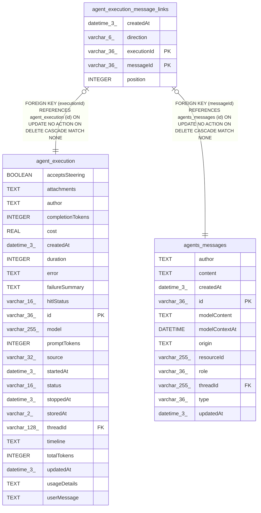

# agent_execution_message_links

## Description

<details>
<summary><strong>Table Definition</strong></summary>

```sql
CREATE TABLE "agent_execution_message_links" ("executionId" varchar(36) NOT NULL, "messageId" varchar(36) NOT NULL, "direction" varchar(6) NOT NULL, "position" integer NOT NULL, "createdAt" datetime(3) NOT NULL DEFAULT (STRFTIME('%Y-%m-%d %H:%M:%f', 'NOW')), CONSTRAINT "CHK_agent_execution_message_links_direction" CHECK ("direction" IN ('input', 'output')), CONSTRAINT "FK_e78f470a036d01f9e395d53bb59" FOREIGN KEY ("executionId") REFERENCES "agent_execution" ("id") ON DELETE CASCADE, CONSTRAINT "FK_be7d0a2fd1360c9fa09baf84f60" FOREIGN KEY ("messageId") REFERENCES "agents_messages" ("id") ON DELETE CASCADE, PRIMARY KEY ("executionId", "messageId"))
```

</details>

## Columns

| Name | Type | Default | Nullable | Children | Parents | Comment |
| ---- | ---- | ------- | -------- | -------- | ------- | ------- |
| createdAt | datetime(3) | STRFTIME('%Y-%m-%d %H:%M:%f', 'NOW') | false |  |  |  |
| direction | varchar(6) |  | false |  |  |  |
| executionId | varchar(36) |  | false |  | [agent_execution](agent_execution.md) |  |
| messageId | varchar(36) |  | false |  | [agents_messages](agents_messages.md) |  |
| position | INTEGER |  | false |  |  |  |

## Constraints

| Name | Type | Definition |
| ---- | ---- | ---------- |
| - | CHECK | CHECK ("direction" IN ('input', 'output')) |
| - (Foreign key ID: 0) | FOREIGN KEY | FOREIGN KEY (messageId) REFERENCES agents_messages (id) ON UPDATE NO ACTION ON DELETE CASCADE MATCH NONE |
| - (Foreign key ID: 1) | FOREIGN KEY | FOREIGN KEY (executionId) REFERENCES agent_execution (id) ON UPDATE NO ACTION ON DELETE CASCADE MATCH NONE |
| executionId | PRIMARY KEY | PRIMARY KEY (executionId) |
| messageId | PRIMARY KEY | PRIMARY KEY (messageId) |
| sqlite_autoindex_agent_execution_message_links_1 | PRIMARY KEY | PRIMARY KEY (executionId, messageId) |

## Indexes

| Name | Definition |
| ---- | ---------- |
| IDX_10fe500ee8877351841799369b | CREATE UNIQUE INDEX "IDX_10fe500ee8877351841799369b" ON "agent_execution_message_links" ("executionId", "direction", "position")  |
| IDX_be7d0a2fd1360c9fa09baf84f6 | CREATE INDEX "IDX_be7d0a2fd1360c9fa09baf84f6" ON "agent_execution_message_links" ("messageId")  |
| sqlite_autoindex_agent_execution_message_links_1 | PRIMARY KEY (executionId, messageId) |

## Relations



---

> Generated by [tbls](https://github.com/k1LoW/tbls)
