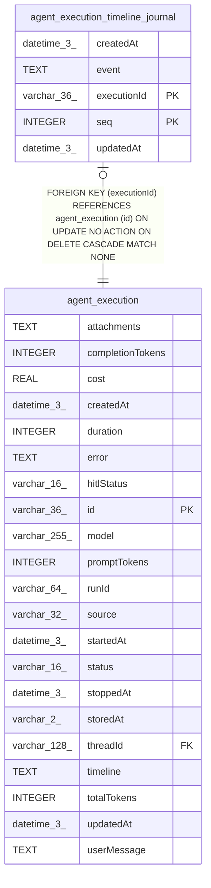

# agent_execution_timeline_journal

## Description

<details>
<summary><strong>Table Definition</strong></summary>

```sql
CREATE TABLE "agent_execution_timeline_journal" ("executionId" varchar(36) NOT NULL, "seq" integer NOT NULL, "event" text NOT NULL, "createdAt" datetime(3) NOT NULL DEFAULT (STRFTIME('%Y-%m-%d %H:%M:%f', 'NOW')), "updatedAt" datetime(3) NOT NULL DEFAULT (STRFTIME('%Y-%m-%d %H:%M:%f', 'NOW')), CONSTRAINT "FK_9b1da3b87ef9d36acb33fbf630c" FOREIGN KEY ("executionId") REFERENCES "agent_execution" ("id") ON DELETE CASCADE, PRIMARY KEY ("executionId", "seq"))
```

</details>

## Columns

| Name | Type | Default | Nullable | Children | Parents | Comment |
| ---- | ---- | ------- | -------- | -------- | ------- | ------- |
| createdAt | datetime(3) | STRFTIME('%Y-%m-%d %H:%M:%f', 'NOW') | false |  |  |  |
| event | TEXT |  | false |  |  |  |
| executionId | varchar(36) |  | false |  | [agent_execution](agent_execution.md) |  |
| seq | INTEGER |  | false |  |  |  |
| updatedAt | datetime(3) | STRFTIME('%Y-%m-%d %H:%M:%f', 'NOW') | false |  |  |  |

## Constraints

| Name | Type | Definition |
| ---- | ---- | ---------- |
| - (Foreign key ID: 0) | FOREIGN KEY | FOREIGN KEY (executionId) REFERENCES agent_execution (id) ON UPDATE NO ACTION ON DELETE CASCADE MATCH NONE |
| executionId | PRIMARY KEY | PRIMARY KEY (executionId) |
| seq | PRIMARY KEY | PRIMARY KEY (seq) |
| sqlite_autoindex_agent_execution_timeline_journal_1 | PRIMARY KEY | PRIMARY KEY (executionId, seq) |

## Indexes

| Name | Definition |
| ---- | ---------- |
| sqlite_autoindex_agent_execution_timeline_journal_1 | PRIMARY KEY (executionId, seq) |

## Relations



---

> Generated by [tbls](https://github.com/k1LoW/tbls)
