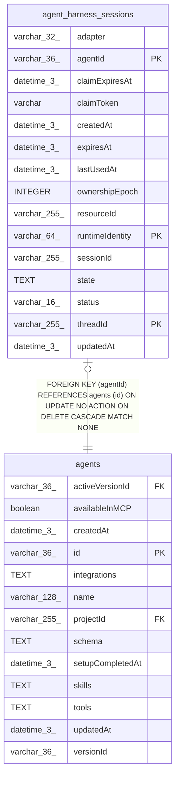

# agent_harness_sessions

## Description

<details>
<summary><strong>Table Definition</strong></summary>

```sql
CREATE TABLE "agent_harness_sessions" ("agentId" varchar(36) NOT NULL, "threadId" varchar(255) NOT NULL, "runtimeIdentity" varchar(64) NOT NULL, "resourceId" varchar(255) NOT NULL, "adapter" varchar(32) NOT NULL, "sessionId" varchar(255) NOT NULL, "state" text, "status" varchar(16) NOT NULL DEFAULT ('idle'), "ownershipEpoch" integer NOT NULL DEFAULT (0), "claimToken" varchar, "claimExpiresAt" datetime(3), "lastUsedAt" datetime(3) NOT NULL, "expiresAt" datetime(3) NOT NULL, "createdAt" datetime(3) NOT NULL DEFAULT (STRFTIME('%Y-%m-%d %H:%M:%f', 'NOW')), "updatedAt" datetime(3) NOT NULL DEFAULT (STRFTIME('%Y-%m-%d %H:%M:%f', 'NOW')), CONSTRAINT "CHK_agent_harness_sessions_status" CHECK (("status" IN ('idle', 'claimed'))), CONSTRAINT "CHK_agent_harness_sessions_adapter" CHECK ("adapter" IN ('claude-code', 'codex', 'claude-code:daytona', 'claude-code:n8n-sandbox', 'codex:daytona', 'codex:n8n-sandbox')), CONSTRAINT "FK_ba8bc431add6f2dedad0886d686" FOREIGN KEY ("agentId") REFERENCES "agents" ("id") ON DELETE CASCADE ON UPDATE NO ACTION, PRIMARY KEY ("agentId", "threadId", "runtimeIdentity"))
```

</details>

## Columns

| Name | Type | Default | Nullable | Children | Parents | Comment |
| ---- | ---- | ------- | -------- | -------- | ------- | ------- |
| adapter | varchar(32) |  | false |  |  |  |
| agentId | varchar(36) |  | false |  | [agents](agents.md) |  |
| claimExpiresAt | datetime(3) |  | true |  |  |  |
| claimToken | varchar |  | true |  |  |  |
| createdAt | datetime(3) | STRFTIME('%Y-%m-%d %H:%M:%f', 'NOW') | false |  |  |  |
| expiresAt | datetime(3) |  | false |  |  |  |
| lastUsedAt | datetime(3) |  | false |  |  |  |
| ownershipEpoch | INTEGER | 0 | false |  |  |  |
| resourceId | varchar(255) |  | false |  |  |  |
| runtimeIdentity | varchar(64) |  | false |  |  |  |
| sessionId | varchar(255) |  | false |  |  |  |
| state | TEXT |  | true |  |  |  |
| status | varchar(16) | 'idle' | false |  |  |  |
| threadId | varchar(255) |  | false |  |  |  |
| updatedAt | datetime(3) | STRFTIME('%Y-%m-%d %H:%M:%f', 'NOW') | false |  |  |  |

## Constraints

| Name | Type | Definition |
| ---- | ---- | ---------- |
| - | CHECK | CHECK (("status" IN ('idle', 'claimed'))) |
| - | CHECK | CHECK ("adapter" IN ('claude-code', 'codex', 'claude-code:daytona', 'claude-code:n8n-sandbox', 'codex:daytona', 'codex:n8n-sandbox')) |
| - (Foreign key ID: 0) | FOREIGN KEY | FOREIGN KEY (agentId) REFERENCES agents (id) ON UPDATE NO ACTION ON DELETE CASCADE MATCH NONE |
| agentId | PRIMARY KEY | PRIMARY KEY (agentId) |
| runtimeIdentity | PRIMARY KEY | PRIMARY KEY (runtimeIdentity) |
| sqlite_autoindex_agent_harness_sessions_1 | PRIMARY KEY | PRIMARY KEY (agentId, threadId, runtimeIdentity) |
| threadId | PRIMARY KEY | PRIMARY KEY (threadId) |

## Indexes

| Name | Definition |
| ---- | ---------- |
| IDX_db9ce6cb7fa876c8dd45a0c0fe | CREATE INDEX "IDX_db9ce6cb7fa876c8dd45a0c0fe" ON "agent_harness_sessions" ("expiresAt")  |
| sqlite_autoindex_agent_harness_sessions_1 | PRIMARY KEY (agentId, threadId, runtimeIdentity) |

## Relations



---

> Generated by [tbls](https://github.com/k1LoW/tbls)
