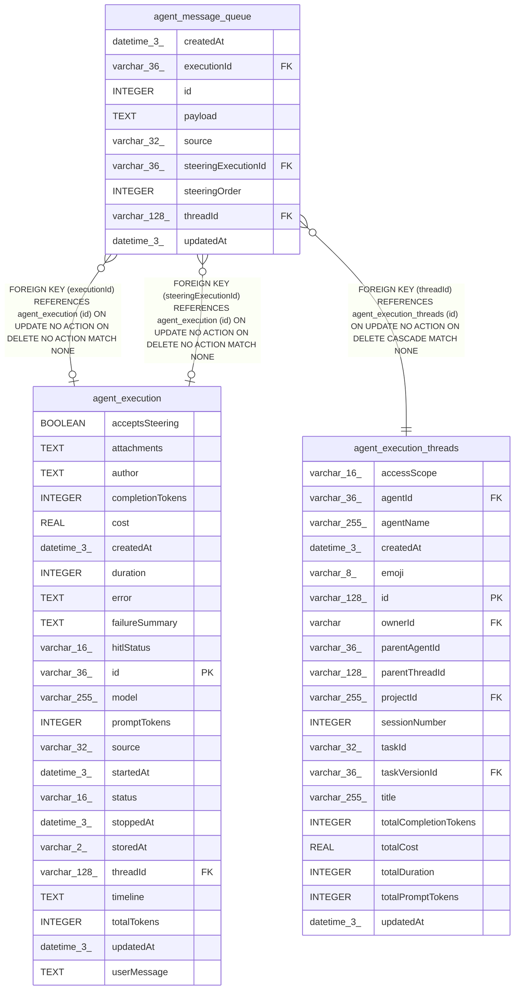

# agent_message_queue

## Description

<details>
<summary><strong>Table Definition</strong></summary>

```sql
CREATE TABLE "agent_message_queue" ("id" integer PRIMARY KEY AUTOINCREMENT NOT NULL, "threadId" varchar(128) NOT NULL, "source" varchar(32) NOT NULL, "payload" text NOT NULL, "executionId" varchar(36), "createdAt" datetime(3) NOT NULL DEFAULT (STRFTIME('%Y-%m-%d %H:%M:%f', 'NOW')), "updatedAt" datetime(3) NOT NULL DEFAULT (STRFTIME('%Y-%m-%d %H:%M:%f', 'NOW')), "steeringExecutionId" varchar(36), "steeringOrder" integer, CONSTRAINT "FK_2349d84b4f2a660fc264f38fef3" FOREIGN KEY ("executionId") REFERENCES "agent_execution" ("id") ON DELETE NO ACTION ON UPDATE NO ACTION, CONSTRAINT "FK_a74f9154a59430986112d70cb16" FOREIGN KEY ("threadId") REFERENCES "agent_execution_threads" ("id") ON DELETE CASCADE ON UPDATE NO ACTION, CONSTRAINT "FK_eff54787927c2968dc24495c911" FOREIGN KEY ("steeringExecutionId") REFERENCES "agent_execution" ("id") ON DELETE NO ACTION)
```

</details>

## Columns

| Name | Type | Default | Nullable | Children | Parents | Comment |
| ---- | ---- | ------- | -------- | -------- | ------- | ------- |
| createdAt | datetime(3) | STRFTIME('%Y-%m-%d %H:%M:%f', 'NOW') | false |  |  |  |
| executionId | varchar(36) |  | true |  | [agent_execution](agent_execution.md) |  |
| id | INTEGER |  | false |  |  |  |
| payload | TEXT |  | false |  |  |  |
| source | varchar(32) |  | false |  |  |  |
| steeringExecutionId | varchar(36) |  | true |  | [agent_execution](agent_execution.md) |  |
| steeringOrder | INTEGER |  | true |  |  |  |
| threadId | varchar(128) |  | false |  | [agent_execution_threads](agent_execution_threads.md) |  |
| updatedAt | datetime(3) | STRFTIME('%Y-%m-%d %H:%M:%f', 'NOW') | false |  |  |  |

## Constraints

| Name | Type | Definition |
| ---- | ---- | ---------- |
| - (Foreign key ID: 0) | FOREIGN KEY | FOREIGN KEY (steeringExecutionId) REFERENCES agent_execution (id) ON UPDATE NO ACTION ON DELETE NO ACTION MATCH NONE |
| - (Foreign key ID: 1) | FOREIGN KEY | FOREIGN KEY (threadId) REFERENCES agent_execution_threads (id) ON UPDATE NO ACTION ON DELETE CASCADE MATCH NONE |
| - (Foreign key ID: 2) | FOREIGN KEY | FOREIGN KEY (executionId) REFERENCES agent_execution (id) ON UPDATE NO ACTION ON DELETE NO ACTION MATCH NONE |
| id | PRIMARY KEY | PRIMARY KEY (id) |

## Indexes

| Name | Definition |
| ---- | ---------- |
| IDX_2349d84b4f2a660fc264f38fef | CREATE INDEX "IDX_2349d84b4f2a660fc264f38fef" ON "agent_message_queue" ("executionId")  |
| IDX_agent_message_queue_steeringExecutionId_steeringOrder | CREATE UNIQUE INDEX "IDX_agent_message_queue_steeringExecutionId_steeringOrder" ON "agent_message_queue" ("steeringExecutionId", "steeringOrder") WHERE "steeringExecutionId" IS NOT NULL |
| IDX_agent_message_queue_threadId | CREATE UNIQUE INDEX "IDX_agent_message_queue_threadId" ON "agent_message_queue" ("threadId") WHERE "executionId" IS NOT NULL |
| IDX_c1db6ea2d031cc49100535e6c6 | CREATE INDEX "IDX_c1db6ea2d031cc49100535e6c6" ON "agent_message_queue" ("threadId", "id")  |

## Relations



---

> Generated by [tbls](https://github.com/k1LoW/tbls)
