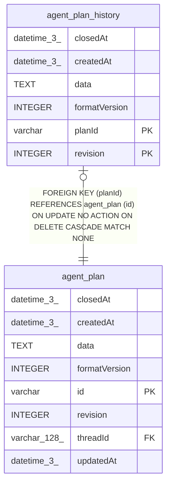

# agent_plan_history

## Description

<details>
<summary><strong>Table Definition</strong></summary>

```sql
CREATE TABLE "agent_plan_history" ("planId" varchar NOT NULL, "revision" integer NOT NULL, "formatVersion" integer NOT NULL, "data" text NOT NULL, "closedAt" datetime(3), "createdAt" datetime(3) NOT NULL DEFAULT (STRFTIME('%Y-%m-%d %H:%M:%f', 'NOW')), CONSTRAINT "CHK_agent_plan_history_revision" CHECK ("revision" > 0), CONSTRAINT "CHK_agent_plan_history_format_version" CHECK ("formatVersion" > 0), CONSTRAINT "FK_ff6ebe6c2b329aba472095b4a5d" FOREIGN KEY ("planId") REFERENCES "agent_plan" ("id") ON DELETE CASCADE, PRIMARY KEY ("planId", "revision"))
```

</details>

## Columns

| Name | Type | Default | Nullable | Children | Parents | Comment |
| ---- | ---- | ------- | -------- | -------- | ------- | ------- |
| closedAt | datetime(3) |  | true |  |  |  |
| createdAt | datetime(3) | STRFTIME('%Y-%m-%d %H:%M:%f', 'NOW') | false |  |  |  |
| data | TEXT |  | false |  |  |  |
| formatVersion | INTEGER |  | false |  |  |  |
| planId | varchar |  | false |  | [agent_plan](agent_plan.md) |  |
| revision | INTEGER |  | false |  |  |  |

## Constraints

| Name | Type | Definition |
| ---- | ---- | ---------- |
| - | CHECK | CHECK ("revision" > 0) |
| - | CHECK | CHECK ("formatVersion" > 0) |
| - (Foreign key ID: 0) | FOREIGN KEY | FOREIGN KEY (planId) REFERENCES agent_plan (id) ON UPDATE NO ACTION ON DELETE CASCADE MATCH NONE |
| planId | PRIMARY KEY | PRIMARY KEY (planId) |
| revision | PRIMARY KEY | PRIMARY KEY (revision) |
| sqlite_autoindex_agent_plan_history_1 | PRIMARY KEY | PRIMARY KEY (planId, revision) |

## Indexes

| Name | Definition |
| ---- | ---------- |
| sqlite_autoindex_agent_plan_history_1 | PRIMARY KEY (planId, revision) |

## Relations



---

> Generated by [tbls](https://github.com/k1LoW/tbls)
