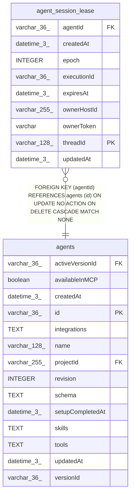

# agent_session_lease

## Description

<details>
<summary><strong>Table Definition</strong></summary>

```sql
CREATE TABLE "agent_session_lease" ("threadId" varchar(128) PRIMARY KEY NOT NULL, "agentId" varchar(36) NOT NULL, "ownerToken" varchar, "ownerHostId" varchar(255), "epoch" integer NOT NULL DEFAULT (0), "executionId" varchar(36), "expiresAt" datetime(3), "createdAt" datetime(3) NOT NULL DEFAULT (STRFTIME('%Y-%m-%d %H:%M:%f', 'NOW')), "updatedAt" datetime(3) NOT NULL DEFAULT (STRFTIME('%Y-%m-%d %H:%M:%f', 'NOW')), CONSTRAINT "FK_d638dff52c334190c7407c22d9b" FOREIGN KEY ("agentId") REFERENCES "agents" ("id") ON DELETE CASCADE)
```

</details>

## Columns

| Name | Type | Default | Nullable | Children | Parents | Comment |
| ---- | ---- | ------- | -------- | -------- | ------- | ------- |
| agentId | varchar(36) |  | false |  | [agents](agents.md) |  |
| createdAt | datetime(3) | STRFTIME('%Y-%m-%d %H:%M:%f', 'NOW') | false |  |  |  |
| epoch | INTEGER | 0 | false |  |  |  |
| executionId | varchar(36) |  | true |  |  |  |
| expiresAt | datetime(3) |  | true |  |  |  |
| ownerHostId | varchar(255) |  | true |  |  |  |
| ownerToken | varchar |  | true |  |  |  |
| threadId | varchar(128) |  | false |  |  |  |
| updatedAt | datetime(3) | STRFTIME('%Y-%m-%d %H:%M:%f', 'NOW') | false |  |  |  |

## Constraints

| Name | Type | Definition |
| ---- | ---- | ---------- |
| - (Foreign key ID: 0) | FOREIGN KEY | FOREIGN KEY (agentId) REFERENCES agents (id) ON UPDATE NO ACTION ON DELETE CASCADE MATCH NONE |
| sqlite_autoindex_agent_session_lease_1 | PRIMARY KEY | PRIMARY KEY (threadId) |
| threadId | PRIMARY KEY | PRIMARY KEY (threadId) |

## Indexes

| Name | Definition |
| ---- | ---------- |
| IDX_d638dff52c334190c7407c22d9 | CREATE INDEX "IDX_d638dff52c334190c7407c22d9" ON "agent_session_lease" ("agentId")  |
| sqlite_autoindex_agent_session_lease_1 | PRIMARY KEY (threadId) |

## Relations



---

> Generated by [tbls](https://github.com/k1LoW/tbls)
