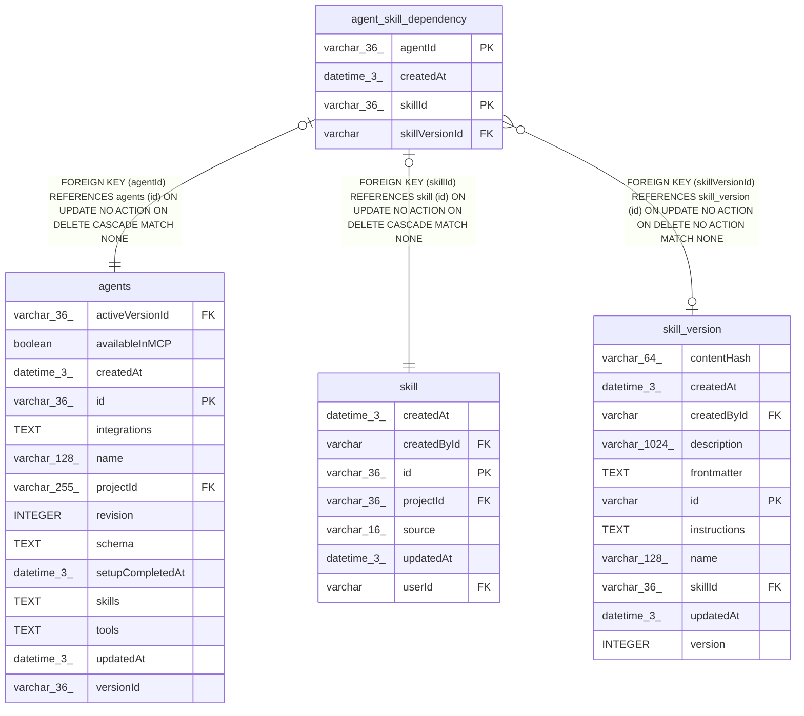

# agent_skill_dependency

## Description

<details>
<summary><strong>Table Definition</strong></summary>

```sql
CREATE TABLE "agent_skill_dependency" ("agentId" varchar(36) NOT NULL, "skillId" varchar(36) NOT NULL, "skillVersionId" varchar, "createdAt" datetime(3) NOT NULL DEFAULT (STRFTIME('%Y-%m-%d %H:%M:%f', 'NOW')), CONSTRAINT "FK_72325bb13511a51847c53fcb377" FOREIGN KEY ("agentId") REFERENCES "agents" ("id") ON DELETE CASCADE, CONSTRAINT "FK_068f21aefba31ae621482f396dc" FOREIGN KEY ("skillId") REFERENCES "skill" ("id") ON DELETE CASCADE, CONSTRAINT "FK_7676571bd6f41d9e32f0d066fe9" FOREIGN KEY ("skillVersionId") REFERENCES "skill_version" ("id") ON DELETE NO ACTION, PRIMARY KEY ("agentId", "skillId"))
```

</details>

## Columns

| Name | Type | Default | Nullable | Children | Parents | Comment |
| ---- | ---- | ------- | -------- | -------- | ------- | ------- |
| agentId | varchar(36) |  | false |  | [agents](agents.md) |  |
| createdAt | datetime(3) | STRFTIME('%Y-%m-%d %H:%M:%f', 'NOW') | false |  |  |  |
| skillId | varchar(36) |  | false |  | [skill](skill.md) |  |
| skillVersionId | varchar |  | true |  | [skill_version](skill_version.md) |  |

## Constraints

| Name | Type | Definition |
| ---- | ---- | ---------- |
| - (Foreign key ID: 0) | FOREIGN KEY | FOREIGN KEY (skillVersionId) REFERENCES skill_version (id) ON UPDATE NO ACTION ON DELETE NO ACTION MATCH NONE |
| - (Foreign key ID: 1) | FOREIGN KEY | FOREIGN KEY (skillId) REFERENCES skill (id) ON UPDATE NO ACTION ON DELETE CASCADE MATCH NONE |
| - (Foreign key ID: 2) | FOREIGN KEY | FOREIGN KEY (agentId) REFERENCES agents (id) ON UPDATE NO ACTION ON DELETE CASCADE MATCH NONE |
| agentId | PRIMARY KEY | PRIMARY KEY (agentId) |
| skillId | PRIMARY KEY | PRIMARY KEY (skillId) |
| sqlite_autoindex_agent_skill_dependency_1 | PRIMARY KEY | PRIMARY KEY (agentId, skillId) |

## Indexes

| Name | Definition |
| ---- | ---------- |
| IDX_068f21aefba31ae621482f396d | CREATE INDEX "IDX_068f21aefba31ae621482f396d" ON "agent_skill_dependency" ("skillId")  |
| IDX_7676571bd6f41d9e32f0d066fe | CREATE INDEX "IDX_7676571bd6f41d9e32f0d066fe" ON "agent_skill_dependency" ("skillVersionId")  |
| sqlite_autoindex_agent_skill_dependency_1 | PRIMARY KEY (agentId, skillId) |

## Relations



---

> Generated by [tbls](https://github.com/k1LoW/tbls)
