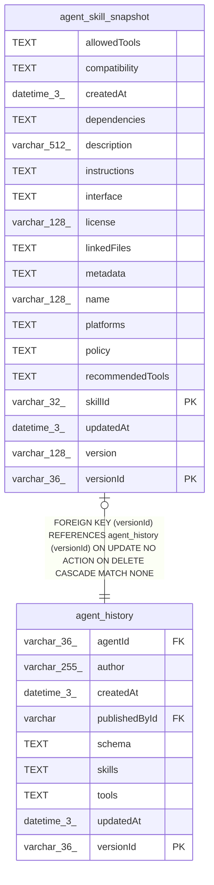

# agent_skill_snapshot

## Description

<details>
<summary><strong>Table Definition</strong></summary>

```sql
CREATE TABLE "agent_skill_snapshot" ("versionId" varchar(36) NOT NULL, "skillId" varchar(32) NOT NULL, "name" varchar(128) NOT NULL, "description" varchar(512) NOT NULL, "instructions" text NOT NULL, "allowedTools" text, "recommendedTools" text, "interface" text, "policy" text, "dependencies" text, "version" varchar(128), "license" varchar(128), "compatibility" text, "platforms" text, "metadata" text, "linkedFiles" text, "createdAt" datetime(3) NOT NULL DEFAULT (STRFTIME('%Y-%m-%d %H:%M:%f', 'NOW')), "updatedAt" datetime(3) NOT NULL DEFAULT (STRFTIME('%Y-%m-%d %H:%M:%f', 'NOW')), CONSTRAINT "FK_0973d001efc4631742658509ed3" FOREIGN KEY ("versionId") REFERENCES "agent_history" ("versionId") ON DELETE CASCADE, PRIMARY KEY ("versionId", "skillId"))
```

</details>

## Columns

| Name | Type | Default | Nullable | Children | Parents | Comment |
| ---- | ---- | ------- | -------- | -------- | ------- | ------- |
| allowedTools | TEXT |  | true |  |  |  |
| compatibility | TEXT |  | true |  |  |  |
| createdAt | datetime(3) | STRFTIME('%Y-%m-%d %H:%M:%f', 'NOW') | false |  |  |  |
| dependencies | TEXT |  | true |  |  |  |
| description | varchar(512) |  | false |  |  |  |
| instructions | TEXT |  | false |  |  |  |
| interface | TEXT |  | true |  |  |  |
| license | varchar(128) |  | true |  |  |  |
| linkedFiles | TEXT |  | true |  |  |  |
| metadata | TEXT |  | true |  |  |  |
| name | varchar(128) |  | false |  |  |  |
| platforms | TEXT |  | true |  |  |  |
| policy | TEXT |  | true |  |  |  |
| recommendedTools | TEXT |  | true |  |  |  |
| skillId | varchar(32) |  | false |  |  |  |
| updatedAt | datetime(3) | STRFTIME('%Y-%m-%d %H:%M:%f', 'NOW') | false |  |  |  |
| version | varchar(128) |  | true |  |  |  |
| versionId | varchar(36) |  | false |  | [agent_history](agent_history.md) |  |

## Constraints

| Name | Type | Definition |
| ---- | ---- | ---------- |
| - (Foreign key ID: 0) | FOREIGN KEY | FOREIGN KEY (versionId) REFERENCES agent_history (versionId) ON UPDATE NO ACTION ON DELETE CASCADE MATCH NONE |
| skillId | PRIMARY KEY | PRIMARY KEY (skillId) |
| sqlite_autoindex_agent_skill_snapshot_1 | PRIMARY KEY | PRIMARY KEY (versionId, skillId) |
| versionId | PRIMARY KEY | PRIMARY KEY (versionId) |

## Indexes

| Name | Definition |
| ---- | ---------- |
| sqlite_autoindex_agent_skill_snapshot_1 | PRIMARY KEY (versionId, skillId) |

## Relations



---

> Generated by [tbls](https://github.com/k1LoW/tbls)
