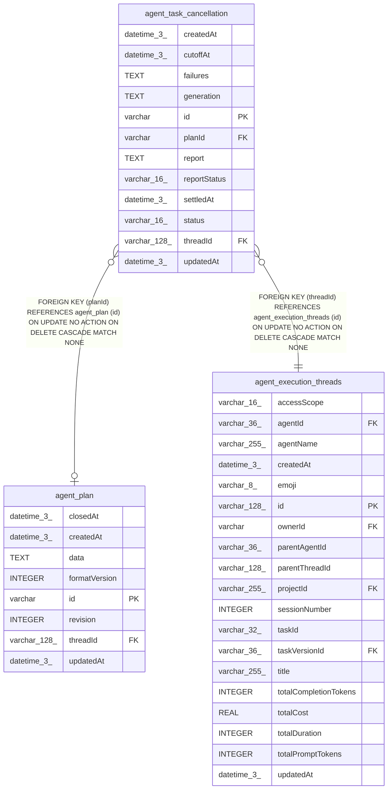

# agent_task_cancellation

## Description

<details>
<summary><strong>Table Definition</strong></summary>

```sql
CREATE TABLE "agent_task_cancellation" ("id" varchar PRIMARY KEY NOT NULL, "threadId" varchar(128) NOT NULL, "planId" varchar, "status" varchar(16) NOT NULL, "cutoffAt" datetime(3) NOT NULL, "settledAt" datetime(3), "generation" text NOT NULL, "failures" text NOT NULL, "reportStatus" varchar(16) NOT NULL, "report" text NOT NULL, "createdAt" datetime(3) NOT NULL DEFAULT (STRFTIME('%Y-%m-%d %H:%M:%f', 'NOW')), "updatedAt" datetime(3) NOT NULL DEFAULT (STRFTIME('%Y-%m-%d %H:%M:%f', 'NOW')), CONSTRAINT "CHK_agent_task_cancellation_status" CHECK ("status" IN ('stopping', 'failed', 'stopped')), CONSTRAINT "CHK_agent_task_cancellation_reportStatus" CHECK ("reportStatus" IN ('pending', 'claimed', 'reported', 'failed')), CONSTRAINT "FK_409a1707f7131381c54316fa5c0" FOREIGN KEY ("threadId") REFERENCES "agent_execution_threads" ("id") ON DELETE CASCADE, CONSTRAINT "FK_4ef6735ac2ee1994eb97505b366" FOREIGN KEY ("planId") REFERENCES "agent_plan" ("id") ON DELETE CASCADE)
```

</details>

## Columns

| Name | Type | Default | Nullable | Children | Parents | Comment |
| ---- | ---- | ------- | -------- | -------- | ------- | ------- |
| createdAt | datetime(3) | STRFTIME('%Y-%m-%d %H:%M:%f', 'NOW') | false |  |  |  |
| cutoffAt | datetime(3) |  | false |  |  |  |
| failures | TEXT |  | false |  |  |  |
| generation | TEXT |  | false |  |  |  |
| id | varchar |  | false |  |  |  |
| planId | varchar |  | true |  | [agent_plan](agent_plan.md) |  |
| report | TEXT |  | false |  |  |  |
| reportStatus | varchar(16) |  | false |  |  |  |
| settledAt | datetime(3) |  | true |  |  |  |
| status | varchar(16) |  | false |  |  |  |
| threadId | varchar(128) |  | false |  | [agent_execution_threads](agent_execution_threads.md) |  |
| updatedAt | datetime(3) | STRFTIME('%Y-%m-%d %H:%M:%f', 'NOW') | false |  |  |  |

## Constraints

| Name | Type | Definition |
| ---- | ---- | ---------- |
| - | CHECK | CHECK ("status" IN ('stopping', 'failed', 'stopped')) |
| - | CHECK | CHECK ("reportStatus" IN ('pending', 'claimed', 'reported', 'failed')) |
| - (Foreign key ID: 0) | FOREIGN KEY | FOREIGN KEY (planId) REFERENCES agent_plan (id) ON UPDATE NO ACTION ON DELETE CASCADE MATCH NONE |
| - (Foreign key ID: 1) | FOREIGN KEY | FOREIGN KEY (threadId) REFERENCES agent_execution_threads (id) ON UPDATE NO ACTION ON DELETE CASCADE MATCH NONE |
| id | PRIMARY KEY | PRIMARY KEY (id) |
| sqlite_autoindex_agent_task_cancellation_1 | PRIMARY KEY | PRIMARY KEY (id) |

## Indexes

| Name | Definition |
| ---- | ---------- |
| IDX_639da16bdb789d32fbf6a9fc8d | CREATE INDEX "IDX_639da16bdb789d32fbf6a9fc8d" ON "agent_task_cancellation" ("threadId", "createdAt")  |
| sqlite_autoindex_agent_task_cancellation_1 | PRIMARY KEY (id) |

## Relations



---

> Generated by [tbls](https://github.com/k1LoW/tbls)
