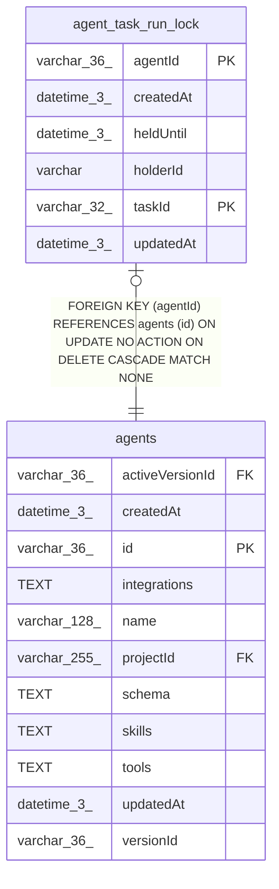

# agent_task_run_lock

## Description

<details>
<summary><strong>Table Definition</strong></summary>

```sql
CREATE TABLE "agent_task_run_lock" ("agentId" varchar(36) NOT NULL, "taskId" varchar(32) NOT NULL, "holderId" varchar NOT NULL, "heldUntil" datetime(3) NOT NULL, "createdAt" datetime(3) NOT NULL DEFAULT (STRFTIME('%Y-%m-%d %H:%M:%f', 'NOW')), "updatedAt" datetime(3) NOT NULL DEFAULT (STRFTIME('%Y-%m-%d %H:%M:%f', 'NOW')), CONSTRAINT "FK_b57a2862ae869aab24e54cefd48" FOREIGN KEY ("agentId") REFERENCES "agents" ("id") ON DELETE CASCADE, PRIMARY KEY ("agentId", "taskId"))
```

</details>

## Columns

| Name | Type | Default | Nullable | Children | Parents | Comment |
| ---- | ---- | ------- | -------- | -------- | ------- | ------- |
| agentId | varchar(36) |  | false |  | [agents](agents.md) |  |
| createdAt | datetime(3) | STRFTIME('%Y-%m-%d %H:%M:%f', 'NOW') | false |  |  |  |
| heldUntil | datetime(3) |  | false |  |  |  |
| holderId | varchar |  | false |  |  |  |
| taskId | varchar(32) |  | false |  |  |  |
| updatedAt | datetime(3) | STRFTIME('%Y-%m-%d %H:%M:%f', 'NOW') | false |  |  |  |

## Constraints

| Name | Type | Definition |
| ---- | ---- | ---------- |
| - (Foreign key ID: 0) | FOREIGN KEY | FOREIGN KEY (agentId) REFERENCES agents (id) ON UPDATE NO ACTION ON DELETE CASCADE MATCH NONE |
| agentId | PRIMARY KEY | PRIMARY KEY (agentId) |
| sqlite_autoindex_agent_task_run_lock_1 | PRIMARY KEY | PRIMARY KEY (agentId, taskId) |
| taskId | PRIMARY KEY | PRIMARY KEY (taskId) |

## Indexes

| Name | Definition |
| ---- | ---------- |
| sqlite_autoindex_agent_task_run_lock_1 | PRIMARY KEY (agentId, taskId) |

## Relations



---

> Generated by [tbls](https://github.com/k1LoW/tbls)
