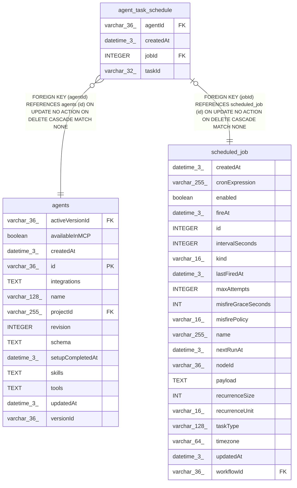

# agent_task_schedule

## Description

<details>
<summary><strong>Table Definition</strong></summary>

```sql
CREATE TABLE "agent_task_schedule" ("jobId" integer PRIMARY KEY NOT NULL, "agentId" varchar(36) NOT NULL, "taskId" varchar(32), "createdAt" datetime(3) NOT NULL DEFAULT (STRFTIME('%Y-%m-%d %H:%M:%f', 'NOW')), CONSTRAINT "FK_b294425c6aa516a3527f13ac986" FOREIGN KEY ("jobId") REFERENCES "scheduled_job" ("id") ON DELETE CASCADE, CONSTRAINT "FK_af48a457a14d137f1dff0ef688f" FOREIGN KEY ("agentId") REFERENCES "agents" ("id") ON DELETE CASCADE)
```

</details>

## Columns

| Name | Type | Default | Nullable | Children | Parents | Comment |
| ---- | ---- | ------- | -------- | -------- | ------- | ------- |
| agentId | varchar(36) |  | false |  | [agents](agents.md) |  |
| createdAt | datetime(3) | STRFTIME('%Y-%m-%d %H:%M:%f', 'NOW') | false |  |  |  |
| jobId | INTEGER |  | false |  | [scheduled_job](scheduled_job.md) |  |
| taskId | varchar(32) |  | true |  |  |  |

## Constraints

| Name | Type | Definition |
| ---- | ---- | ---------- |
| - (Foreign key ID: 0) | FOREIGN KEY | FOREIGN KEY (agentId) REFERENCES agents (id) ON UPDATE NO ACTION ON DELETE CASCADE MATCH NONE |
| - (Foreign key ID: 1) | FOREIGN KEY | FOREIGN KEY (jobId) REFERENCES scheduled_job (id) ON UPDATE NO ACTION ON DELETE CASCADE MATCH NONE |
| jobId | PRIMARY KEY | PRIMARY KEY (jobId) |

## Indexes

| Name | Definition |
| ---- | ---------- |
| IDX_af48a457a14d137f1dff0ef688 | CREATE INDEX "IDX_af48a457a14d137f1dff0ef688" ON "agent_task_schedule" ("agentId")  |

## Relations



---

> Generated by [tbls](https://github.com/k1LoW/tbls)
